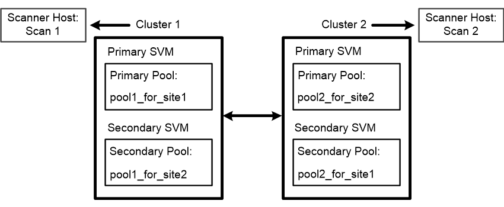

= Erstellen von Scannerpools in MetroCluster-Konfigurationen
:allow-uri-read: 
:icons: font
:imagesdir: ../media/

[role="lead"]
Sie müssen primäre und sekundäre Scannerpools auf jedem Cluster einer MetroCluster Konfiguration erstellen, die den primären und sekundären SVMs im Cluster entsprechen.

.Was Sie benötigen
* SVMs und Vscan-Server müssen sich in derselben Domäne oder in vertrauenswürdigen Domänen befinden.
* Für Scannerpools, die für eine einzelne SVM definiert sind, müssen Sie den ONTAP Antivirus Connector mit der SVM Management LIF oder der SVM Daten-LIF konfiguriert haben.
* Für alle in einem Cluster definierten Scannerpools muss der ONTAP Antivirus Connector mit der Cluster-Management-LIF konfiguriert sein.

.Über diese Aufgabe
MetroCluster Konfigurationen sichern Daten, indem zwei physisch getrennte gespiegelte Cluster implementiert werden. Jedes Cluster repliziert die Daten synchron zur SVM-Konfiguration des anderen. Eine primäre SVM auf dem lokalen Cluster stellt Daten bereit, wenn das Cluster online ist. Eine sekundäre SVM auf dem lokalen Cluster stellt Daten bereit, wenn das Remote-Cluster offline ist.

Das bedeutet, dass Sie primäre und sekundäre Scanner-Pools auf jedem Cluster einer MetroCluster Konfiguration erstellen müssen, die den primären und sekundären SVMs im Cluster entsprechen. Der sekundäre Pool wird aktiv, wenn das Cluster mit der Bereitstellung von Daten von der sekundären SVM beginnt. Die folgende Abbildung zeigt eine typische MetroCluster-Konfiguration.

[NOTE]
====
Die Liste der privilegierten Benutzer muss das Domain-Benutzerkonto enthalten, das der Vscan-Server zur Verbindung mit der SVM verwendet.

====
.Schritte
. Erstellen eines Scannerpools:
+
`vserver vscan scanner-pool create -vserver _data_SVM|cluster_admin_SVM_ -scanner-pool _scanner_pool_ -hostnames _Vscan_server_hostnames_ -privileged-users _privileged_users_`

+
** Legen Sie eine Daten-SVM für einen Pool fest, der für eine einzelne SVM definiert ist, und geben Sie eine Cluster-Admin-SVM für einen Pool an, der für alle SVMs in einem Cluster definiert ist.
** Geben Sie für jeden Host-Namen des Vscan-Servers eine IP-Adresse oder einen FQDN an.
** Geben Sie die Domäne und den Benutzernamen für jeden privilegierten Benutzer an.

+
[NOTE]
====
Sie müssen alle Scannerpools aus dem Cluster erstellen, das die primäre SVM enthält.

====
+
Eine vollständige Liste der Optionen finden Sie auf der man-Page für den Befehl.

+
Mit den folgenden Befehlen werden primäre und sekundäre Scannerpools auf jedem Cluster in einer MetroCluster-Konfiguration erstellt:

+
[listing]
----
cluster1::> vserver vscan scanner-pool create -vserver cifssvm1 -
scanner-pool pool1_for_site1 -hostnames scan1 -privileged-users cifs
\u1,cifs\u2

cluster1::> vserver vscan scanner-pool create -vserver cifssvm1 -
scanner-pool pool1_for_site2 -hostnames scan1 -privileged-users cifs
\u1,cifs\u2

cluster1::> vserver vscan scanner-pool create -vserver cifssvm1 -
scanner-pool pool2_for_site1 -hostnames scan2 -privileged-users cifs
\u1,cifs\u2

cluster1::> vserver vscan scanner-pool create -vserver cifssvm1 -
scanner-pool pool2_for_site2 -hostnames scan2 -privileged-users cifs
\u1,cifs\u2
----
. Überprüfen Sie, ob die Scannerpools erstellt wurden: `vserver vscan scanner-pool show -vserver _data_SVM|cluster_admin_SVM_ -scanner-pool _scanner_pool_`
+
Eine vollständige Liste der Optionen finden Sie auf der man-Page für den Befehl.

+
Mit dem folgenden Befehl werden die Details für den Scannerpool angezeigt `pool1`:

+
[listing]
----
cluster1::> vserver vscan scanner-pool show -vserver cifssvm1 -scanner-pool pool1_for_site1

                                    Vserver: cifssvm1
                               Scanner Pool: pool1_for_site1
                             Applied Policy: idle
                             Current Status: off
         Cluster on Which Policy Is Applied: -
                  Scanner Pool Config Owner: vserver
       List of IPs of Allowed Vscan Servers:
List of Host Names of Allowed Vscan Servers: scan1
                   List of Privileged Users: cifs\u1,cifs\u2
----
+
Sie können auch die verwenden `vserver vscan scanner-pool show` Befehl zum Anzeigen aller Scannerpools auf einer SVM. Eine vollständige Befehlssyntax finden Sie in der man-Page für den Befehl.

