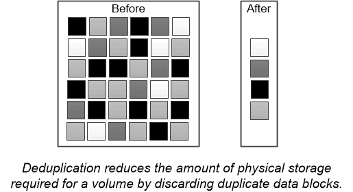

= Deduplizierung
:allow-uri-read: 
:icons: font
:imagesdir: ../media/

[role="lead"]
_Deduplizierung_ reduziert die Menge an physischem Storage, die für ein Volume (oder alle Volumes in einem AFF Aggregat) benötigt wird, indem doppelte Blöcke verworfen und durch Verweise auf einen einzigen, gemeinsam genutzten Block ersetzt werden. Lesezugriffe auf deduplizierte Daten verursachen in der Regel keine Performance-Kosten. Schreibvorgänge sind mit Ausnahme überlasteter Nodes unwesentliche Gebühren zu rechnen.

Wenn Daten während der normalen Verwendung geschrieben werden, verwendet WAFL einen Batch-Prozess, um einen Katalog mit _Block-Signaturen zu erstellen._ nach Beginn der Deduplizierung vergleicht ONTAP die Signaturen im Katalog, um doppelte Blöcke zu identifizieren. Falls eine Übereinstimmung vorhanden ist, wird ein Vergleich Byte-für-Byte durchgeführt, um zu überprüfen, dass die Blockkandidaten seit dem Erstellen des Katalogs nicht geändert wurden. Nur wenn alle Bytes übereinstimmen, wird der duplizierte Block entfernt und der dadurch freigegebene Plattenplatz wieder nutzbar.

