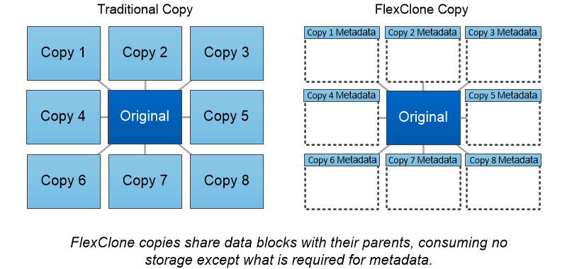

= FlexClone Volumes, Dateien und LUNs
:allow-uri-read: 
:icons: font
:imagesdir: ../media/

[role="lead"]
_FlexClone_ Technologie referenziert Snapshot Metadaten, um beschreibbare, zeitpunktgenaue Kopien eines Volume zu erstellen. Kopien verwenden Datenblöcke gemeinsam mit ihren Eltern und verbrauchen somit keinen Storage, wenn nur die für Metadaten erforderlichen Daten verwendet werden, bis Änderungen in die Kopie geschrieben werden. FlexClone Dateien und FlexClone LUNs verwenden eine identische Technologie, mit Ausnahme dessen, dass eine zugrunde liegende Snapshot Kopie nicht erforderlich ist.

Bei der Erstellung herkömmlicher Kopien dauert die Erstellung von Minuten oder gar Stunden, mit FlexClone können Sie selbst die größten Datensätze nahezu sofort kopieren. Daher eignet sie sich ideal für Situationen, in denen mehrere Kopien identischer Datensätze (z. B. virtuelle Desktop-Implementierungen) oder temporäre Kopien eines Datensatzes benötigt werden (d. h. eine Applikation gegen einen Produktionsdatensatz testen).

Sie können ein vorhandenes FlexClone Volume klonen, ein Volume mit LUN-Klonen klonen oder gespiegelte und Vault-Daten klonen. Sie können ein FlexClone Volume _vom übergeordneten Volume aufteilen, in diesem Fall wird der Kopie seinem eigenen Storage zugewiesen.

