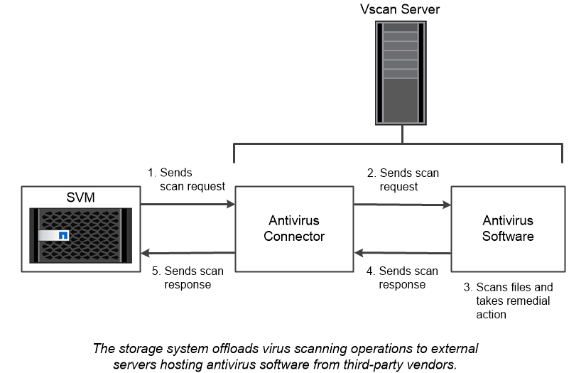

= Virenscan
:allow-uri-read: 
:icons: font
:imagesdir: ../media/

[role="lead"]
Sie können die integrierte Antivirenfunktion des Speichersystems nutzen, um Daten vor einer Kompromittierung durch Viren oder andere Schadsoftware zu schützen. Die ONTAP Virenprüfung, genannt _Vscan_, kombiniert erstklassige Antivirensoftware von Drittanbietern mit ONTAP Funktionen und bietet die Flexibilität, festzulegen, welche Dateien wann gescannt werden.

Speichersysteme lagern Scanvorgänge an externe Server aus, auf denen Antivirensoftware von Drittanbietern gehostet wird. Der _ONTAP Antivirus Connector_, bereitgestellt von NetApp und auf dem externen Server installiert, übernimmt die Kommunikation zwischen dem Speichersystem und der Antivirensoftware.

* Die _On-Access-Prüfung_ kann verwendet werden, um Dateien beim Öffnen, Lesen, Umbenennen oder Schließen über SMB auf Viren zu überprüfen. Die Dateioperation wird ausgesetzt, bis der externe Server den Prüfstatus der Datei meldet. Wurde die Datei bereits geprüft, erlaubt ONTAP die Dateioperation. Andernfalls wird eine Prüfung vom Server angefordert.
+
On-access-Scanning wird für NFS nicht unterstützt.

* Die bedarfsgesteuerte Überprüfung kann verwendet werden, um Dateien sofort oder nach einem Zeitplan auf Viren zu prüfen. So kann beispielsweise festgelegt werden, dass Prüfungen nur außerhalb der Spitzenzeiten erfolgen. Der externe Server aktualisiert den Prüfstatus der überprüften Dateien, sodass die Zugriffsverzögerung für diese Dateien (sofern sie nicht verändert wurden) beim nächsten Zugriff über SMB in der Regel verringert ist.
+
Sie können die On-Demand-Scanfunktion für jeden Pfad im SVM-Namensraum verwenden, auch für Volumes, die nur über NFS exportiert werden.

Normalerweise werden auf einem SVM beide Scanmodi aktiviert. In beiden Modi ergreift die Antivirensoftware basierend auf Ihren Einstellungen in der Software Maßnahmen zur Behebung infizierter Dateien.

|===

 a| 
*Virenprüfung bei Notfallwiederherstellung und MetroCluster Konfigurationen*

Für die Notfallwiederherstellung und MetroCluster Konfigurationen ist es erforderlich, separate Vscan Server für die lokalen und die Partnercluster einzurichten.

|===

