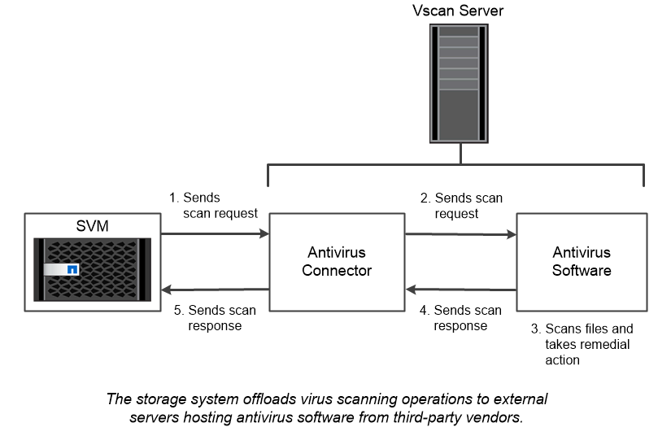

= Virus-Scan
:allow-uri-read: 
:icons: font
:imagesdir: ../media/

[role="lead"]
Sie können die integrierte Virenschutzfunktionalität des Storage-Systems verwenden, um Daten vor Viren oder anderen schädlichen Angriffen zu schützen. ONTAP Virus Scanning, genannt _Vscan_, kombiniert erstklassige Antivirensoftware von Drittanbietern mit ONTAP-Funktionen, die Ihnen die Flexibilität geben, die Sie benötigen, um zu kontrollieren, welche Dateien gescannt werden und wann.

Storage-Systeme verlagern Scanvorgänge auf externe Server, auf denen Virenschutz-Software von Drittanbietern gehostet wird. Der von NetApp bereitgestellte _ONTAP Antivirus Connector_ wickelt die Kommunikation zwischen dem Storage-System und der Virenschutz-Software ab. Er wird auf dem externen Server installiert.

* Sie können _On-Access Scanning_ verwenden, um nach Viren zu suchen, wenn Clients Dateien über SMB öffnen, lesen, umbenennen oder schließen. Der Dateivorgang wird angehalten, bis der externe Server den Scanstatus der Datei meldet. Wenn die Datei bereits gescannt wurde, ermöglicht ONTAP den Dateivorgang. Andernfalls fordert er einen Scan vom Server an.
+
Das Scannen beim Zugriff wird für NFS nicht unterstützt.

* Sie können _On-Demand Scan_ verwenden, um Dateien sofort oder nach Zeitplan auf Viren zu überprüfen. Möglicherweise sollten Sie Scans nur außerhalb der Stoßzeiten durchführen, z. B.. Der externe Server aktualisiert den Scanstatus der überprüften Dateien, sodass die Verzögerung beim Dateizugriff für diese Dateien (sofern sie nicht geändert wurden) in der Regel beim nächsten Zugriff über SMB reduziert wird.
+
Der bedarfsorientierte Scan eignet sich für jeden Pfad im SVM Namespace. Dies gilt auch für Volumes, die nur über NFS exportiert werden.

Sie aktivieren normalerweise beide Scanmodi auf einer SVM. In beiden Modi übernimmt die Antivirus-Software basierend auf Ihren Einstellungen in der Software eine Störungsbehebung bei infizierten Dateien.

|===

 a| 
*_Virus-Scanning in Disaster Recovery- und MetroCluster-Konfigurationen_*

Für Disaster Recovery- und MetroCluster-Konfigurationen müssen separate Vscan-Server für lokale und Partner-Cluster eingerichtet werden.

|===

