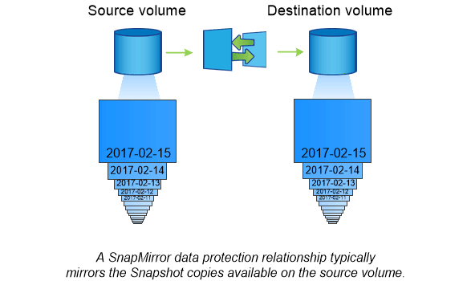

= Grundlagen der asynchronen SnapMirror Disaster Recovery
:allow-uri-read: 
:icons: font
:imagesdir: ../media/

[role="lead"]
_SnapMirror_ ist eine Disaster Recovery-Technologie für den Failover von primärem Storage zu sekundärem Storage an einem geografisch verteilten Standort. Wie der Name schon andeutet, erstellt SnapMirror ein Replikat, oder _Mirror_ Ihrer Arbeitsdaten im Sekundärspeicher, von dem Sie im K-Fall am primären Standort weiter Daten bereitstellen können.

Wenn der primäre Standort weiterhin Daten versorgen kann, können Sie einfach alle benötigten Daten zurück darauf übertragen und nicht Clients vom Spiegel bedienen. Wie der Anwendungsfall für Failover impliziert, sollten die Controller auf dem sekundären System äquivalent oder fast vergleichbar mit den Controllern auf dem Primärsystem sein, um Daten effizient aus dem gespiegelten Storage bereitzustellen.

== Datensicherungsbeziehungen

Daten werden auf Volume-Ebene gespiegelt. Die Beziehung zwischen dem Quell-Volume im primären Storage und dem Ziel-Volume im sekundären Storage wird als „_Data Protection Relationship“ bezeichnet._ die Cluster, in denen sich die Volumes befinden, und die SVMs, die Daten aus den Volumes bereitstellen, müssen _peering durchgeführt werden._ Eine Peer-Beziehung ermöglicht den Austausch von Clustern und SVMs Sicher aus Daten.

https://docs.netapp.com/us-en/ontap-sm-classic/peering/index.html["Cluster- und SVM-Peering"]

In der folgenden Abbildung werden SnapMirror Datensicherungsbeziehungen dargestellt.

== Umfang Datensicherungsbeziehungen

Sie können eine Datensicherungsbeziehung direkt zwischen Volumes oder zwischen den SVMs, die Eigentümer der Volumes sind, erstellen. In einer Datensicherungsbeziehung mit SVM, die vollständig oder teilweise von der SVM-Konfiguration, von NFS-Exporten und SMB-Freigaben bis hin zur rollenbasierten Zugriffssteuerung, repliziert wird, sowie die Daten in den Volumes, die die SVM besitzt.

SnapMirror kann auch für besondere Datensicherungsapplikationen eingesetzt werden:

* Eine _Load-Sharing-Mirror_ Kopie des SVM Root-Volume stellt sicher, dass im Falle eines Node-Ausfalls oder eines Failover auf die Daten zugegriffen werden kann.
* Eine Datensicherungsbeziehung zwischen _SnapLock Volumes_ ermöglicht es Ihnen, WORM-Dateien in den Sekundärspeicher zu replizieren.
+
link:../snaplock/index.html["Archivierung und Compliance mit SnapLock Technologie"]

* Ab ONTAP 9.13.1 können Sie asynchronen SnapMirror zum Schutz verwenden xref:../consistency-groups/index.html[Konsistenzgruppen]. Ab ONTAP 9.14.1 können Sie mithilfe von asynchronem SnapMirror Snapshots des Volumes mithilfe der Konsistenzgruppenbeziehung in den Ziel-Cluster replizieren. Weitere Informationen finden Sie unter xref:../consistency-groups/protect-task.html#configure-asynchronous-snapmirror-protection[Konfigurieren Sie den asynchronen SnapMirror Schutz].

== So werden die SnapMirror Datensicherungsbeziehungen initialisiert

Beim ersten Aufruf von SnapMirror führt es einen _Baseline-Transfer_ vom Quell-Volume zum Ziel-Volume durch. Die Richtlinie _SnapMirror_ für die Beziehung definiert den Inhalt der Baseline und alle Updates.

Basistransfer unter der Standard-SnapMirror-Richtlinie `MirrorAllSnapshots` Umfasst die folgenden Schritte:

* Erstellen einer Snapshot Kopie des Quell-Volume
* Übertragen Sie die Snapshot Kopie und alle Datenblöcke, auf die sie auf das Ziel-Volume verweist.
* Übertragen Sie die verbleibenden, weniger aktuellen Snapshot Kopien auf dem Quell-Volume auf das Ziel-Volume, falls die „`aktive`“-Spiegelung beschädigt ist.

== Aktualisierung von SnapMirror Datensicherungsbeziehungen

Updates werden asynchron und folgen dem von Ihnen konfigurierten Zeitplan. Die Aufbewahrung spiegelt die Snapshot-Richtlinie auf der Quelle.

Bei jedem Update unter dem `MirrorAllSnapshots` Richtlinie: SnapMirror erstellt eine Snapshot Kopie des Quell-Volume und überträgt diese Snapshot Kopie sowie alle Snapshot Kopien, die seit der letzten Aktualisierung erstellt wurden. In der folgenden Ausgabe von der `snapmirror policy show` Befehl für das `MirrorAllSnapshots` Richtlinie, beachten Sie Folgendes:

* `Create Snapshot` Ist „`true`“, was darauf hinweist `MirrorAllSnapshots` Erstellt eine Snapshot Kopie, wenn SnapMirror die Beziehung aktualisiert.
* `MirrorAllSnapshots` Verfügt über Regeln „`sm_created`“ und „`all_source_Snapshots`“, die angeben, dass sowohl die von SnapMirror erstellte Snapshot Kopie als auch alle Snapshot Kopien, die seit der letzten Aktualisierung erstellt wurden, übertragen werden, wenn SnapMirror die Beziehung aktualisiert.

[listing]
----
cluster_dst::> snapmirror policy show -policy MirrorAllSnapshots -instance

                     Vserver: vs0
      SnapMirror Policy Name: MirrorAllSnapshots
      SnapMirror Policy Type: async-mirror
                Policy Owner: cluster-admin
                 Tries Limit: 8
           Transfer Priority: normal
   Ignore accesstime Enabled: false
     Transfer Restartability: always
 Network Compression Enabled: false
             Create Snapshot: true
                     Comment: Asynchronous SnapMirror policy for mirroring all snapshots
                              and the latest active file system.
       Total Number of Rules: 2
                  Total Keep: 2
                       Rules: SnapMirror Label     Keep  Preserve Warn Schedule Prefix
                              ----------------     ----  -------- ---- -------- ------
                              sm_created              1  false       0 -        -
                              all_source_snapshots    1  false       0 -        -
----

== MirrorLatest-Richtlinie

Der vorkonfigurierten `MirrorLatest` Politik funktioniert genau wie `MirrorAllSnapshots`, Außer dass nur die von SnapMirror erstellte Snapshot Kopie bei der Initialisierung und Aktualisierung übertragen wird.

[listing]
----

                       Rules: SnapMirror Label     Keep  Preserve Warn Schedule Prefix
                              ----------------     ----  -------- ---- -------- ------
                              sm_created              1  false       0 -        -
----