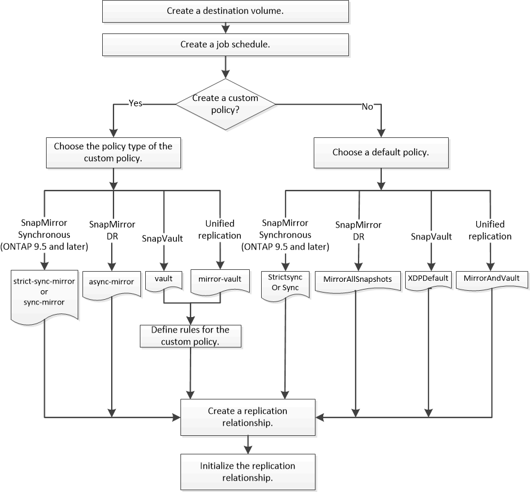

= SnapMirror Replizierungs-Workflow
:allow-uri-read: 
:icons: font
:imagesdir: ../media/

[role="lead"]
SnapMirror bietet drei Arten von Datensicherungsbeziehungen: SnapMirror DR, Archiv (ehemals SnapVault) und einheitliche Replizierung. Sie können denselben grundlegenden Workflow verwenden, um die einzelnen Beziehungstypen zu konfigurieren.

Ab der allgemeinen Verfügbarkeit ab ONTAP 9.9 bietet SnapMirror Business Continuity (SM-BC) eine Recovery Time Objective (Zero RTO) oder ein transparentes Applikations-Failover (TAF) für den automatischen Failover geschäftskritischer Applikationen in SAN-Umgebungen. SM-BC wird in einer Konfiguration von zwei AFF-Clustern oder zwei All-Flash SAN-Array (ASA)-Clustern unterstützt.

https://docs.netapp.com/us-en/ontap/smbc["NetApp Dokumentation: SnapMirror Business Continuity"]

Für jede Art der SnapMirror Datensicherungsbeziehung ist der Workflow derselbe: Erstellen Sie ein Ziel-Volume, erstellen Sie einen Job-Zeitplan, legen Sie eine Richtlinie fest, erstellen und initialisieren Sie die Beziehung.

Ab ONTAP 9.3 können Sie den verwenden `snapmirror protect` Befehl zum Konfigurieren einer Datensicherungsbeziehung in einem einzigen Schritt. Auch wenn Sie verwenden `snapmirror protect`, Sie müssen jeden Schritt im Workflow verstehen.

