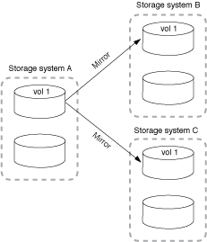
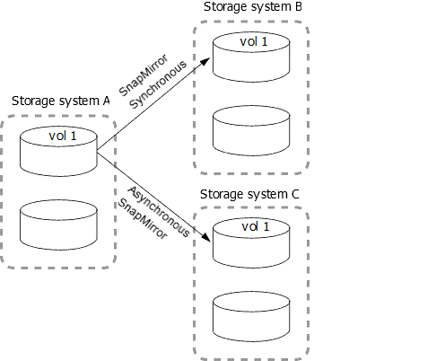

= Fan-out- und kaskadierende Datensicherungsimplementierungen
:allow-uri-read: 
:icons: font
:imagesdir: ../media/

[role="lead"]
Mithilfe einer Implementierung „ _Fan-out_“ lässt sich die Datensicherung auf mehrere sekundäre Systeme erweitern. Mithilfe einer Implementierung „_Kaskadierung_“ lässt sich die Datensicherung auf tertiäre Systeme erweitern.

Sowohl Fan-out- als auch Kaskadenimplementierungen unterstützen eine beliebige Kombination aus SnapMirror DR, SnapVault oder einheitlicher Replizierung, allerdings unterstützen SnapMirror Synchronous Beziehungen (ab ONTAP 9.5 unterstützt) nur Fan-out-Implementierungen mit einer oder mehreren asynchronen SnapMirror Beziehungen und unterstützen keine Kaskadierung. Nur eine Beziehung in der Fan-out-Konfiguration kann eine SnapMirror synchrone Beziehung sein. Alle anderen Beziehungen des Quell-Volumes müssen asynchrone SnapMirror Beziehungen sein. xref:../smbc/resume-protection-fan-out-configuration.html[SnapMirror Business Continuity] (Ab ONTAP 9.8 unterstützt) unterstützt auch Fan-out-Konfigurationen.

NOTE: Mithilfe einer _Fan-in_-Implementierung lassen sich Datensicherungsbeziehungen zwischen mehreren Primärsystemen und einem einzigen sekundären System erstellen. Für jede Beziehung muss auf dem sekundären System ein anderes Volume verwendet werden.

NOTE: Beachten Sie, dass Volumes, die zu einer Fan-out- oder Kaskadenkonfiguration gehören, länger dauern können, um die Synchronisierung erneut zu synchronisieren. Es ist nicht ungewöhnlich, dass die SnapMirror Beziehung den Status „Vorbereitung“ für einen längeren Zeitraum meldet.

== Funktionsweise von Fan-out-Implementierungen

SnapMirror unterstützt mehrere Spiegelungen_ und _Mirror-Vault_ Fan-out-Implementierungen.

Eine Implementierung von Fan-out-Objekten aus mehreren Spiegelungen besteht aus einem Quell-Volume, das über eine Spiegelbeziehung zu mehreren sekundären Volumes verfügt.

Eine Implementierung von Fan-Vault-Fan-out besteht aus einem Quell-Volume, das über eine Spiegelbeziehung zu einem sekundären Volume und einer SnapVault Beziehung zu einem anderen sekundären Volume verfügt.

Ab ONTAP 9.5 können Fan-out-Implementierungen mit synchronen SnapMirror Beziehungen genutzt werden. Allerdings kann nur eine Beziehung der Fan-out-Konfiguration eine synchrone SnapMirror Beziehung sein, alle anderen Beziehungen des Quell-Volume müssen asynchrone SnapMirror Beziehungen sein.

== Funktionsweise der Kaskadierung

SnapMirror unterstützt _Mirror-Mirror_, _Mirror-Vault_, _Vault-Mirror_ und _Vault-Vault_ Kaskaden.

Eine Kaskadierung mit Spiegelspiegelung besteht aus einer Kette von Beziehungen, bei denen ein Quell-Volume auf ein sekundäres Volume gespiegelt und das sekundäre Volume auf einem tertiären Volume gespiegelt wird. Falls das sekundäre Volume nicht mehr verfügbar ist, können Sie die Beziehung zwischen dem primären und dem tertiären Volume synchronisieren, ohne einen neuen Basistransfer durchführen zu müssen.

Ab ONTAP 9.6 werden SnapMirror Synchronous Beziehungen in einer Kaskadierung mit Spiegelung unterstützt. Nur die primären und sekundären Volumes können sich in einer SnapMirror synchronen Beziehung befinden. Das Verhältnis zwischen sekundären Volumes und tertiären Volumes muss asynchron sein.

image::../media/sm-mirror-mirror-cascade.png[SnapMirror Implementierung: Kaskadierungs-Kette mit Spiegelung zu replizieren]

Eine Kaskadenbereitstellung mit Spiegelgewölbe setzt sich aus einer Kette von Beziehungen zusammen, bei denen ein Quell-Volume auf ein sekundäres Volume gespiegelt und das sekundäre Volume in ein tertiäres Volume verlagert wird.

image::../media/sm-mirror-vault-cascade.png[SnapMirror Implementierung: Speicherkette zur Spiegelung/Vault-Kaskadierung]

Auch Vault-Mirror und ab ONTAP 9.2 werden Vault-Kaskadierungs-Implementierungen unterstützt:

* Eine Kaskadenbereitstellung mit Vault-Spiegelung besteht aus einer Kette von Beziehungen, bei denen ein Quell-Volume auf ein sekundäres Volume archiviert wird und das sekundäre Volume auf ein tertiäres Volume gespiegelt wird.
* (Beginnend mit ONTAP 9.2) Eine Vault-Kaskadierung besteht aus einer Kette von Beziehungen, bei denen ein Quell-Volume auf ein sekundäres Volume verlagert wird und das sekundäre Volume auf ein tertiäres Volume verlagert wird.

.Weitere Informationen
* xref:../smbc/resume-protection-fan-out-configuration.html[Setzen Sie den Schutz in einer Fan-out-Konfiguration mit SM-BC fort]

