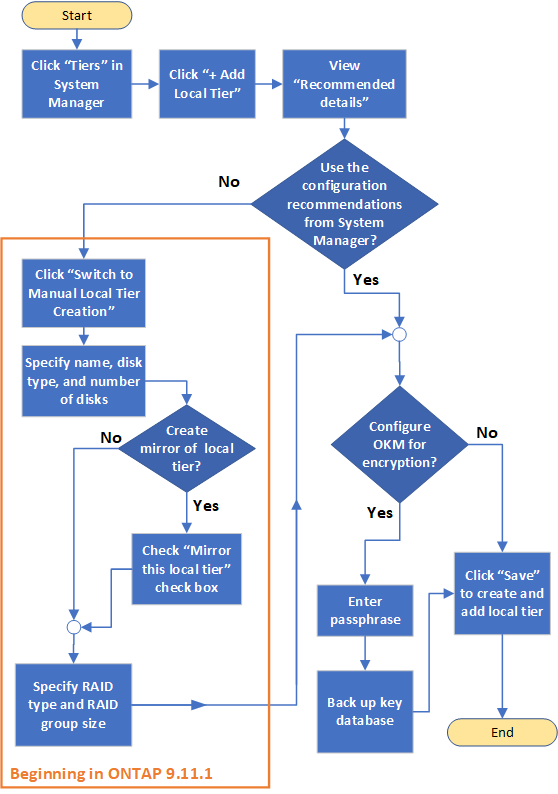

= Workflow zum Hinzufügen einer ONTAP lokalen Ebene
:allow-uri-read: 
:icons: font
:imagesdir: ../media/

[role="lead"]
Die Erstellung lokaler Tiers stellt Speicher für Volumes auf Ihrem System bereit.

NOTE: Vor ONTAP 9.7 verwendet System Manager den Begriff _aggregate_, um eine _lokale Ebene_ zu beschreiben. Unabhängig von der ONTAP Version verwendet die ONTAP CLI den Begriff _aggregate_. Weitere Informationen zu lokalen Ebenen finden sich unter link:../disks-aggregates/index.html["Festplatten und lokale Ebenen"].

Der Workflow zum Erstellen lokaler Ebenen ist spezifisch für die verwendete Schnittstelle: System Manager oder die CLI.

[role="tabbed-block"]
====
.System Manager
--
System Manager erstellt lokale Ebenen basierend auf empfohlenen Best Practices für die Konfiguration lokaler Ebenen.

Ab ONTAP 9.11.1 besteht die Möglichkeit, lokale Ebenen manuell zu konfigurieren, falls eine andere Konfiguration als die während des automatischen Prozesses zum Hinzufügen einer lokalen Ebene empfohlene gewünscht wird.

--
.CLI
--
ONTAP kann beim Erstellen lokaler Tiers (Auto-Provisioning) empfohlene Konfigurationen bereitstellen. Wenn die empfohlenen Konfigurationen, basierend auf Best Practices, für Ihre Umgebung geeignet sind, können diese zur Erstellung des lokalen Tiers übernommen werden. Andernfalls ist es möglich, lokale Tiers manuell zu erstellen.

image:aggregate-creation-workflow.gif["Workflow zur Erstellung lokaler Tiers"]

--
====