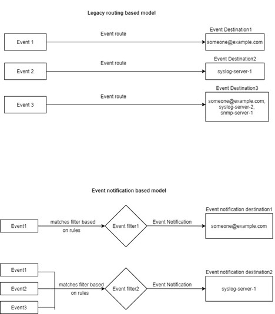

= Informationen zu den Ereigniszuordnungsmodellen von ONTAP EMS
:allow-uri-read: 
:icons: font
:imagesdir: ../media/

[role="lead"]
Vor ONTAP 9.0 konnten EMS-Ereignisse nur anhand von Namensmustern Ereigniszielen zugeordnet werden. Die ONTAP Befehlssätze (`event destination`, `event route`), die dieses Modell verwenden, sind weiterhin in den neuesten Versionen von ONTAP verfügbar, wurden jedoch ab ONTAP 9.0 als veraltet eingestuft.

Ab ONTAP 9.0 ist die Best Practice für die Ereigniszielzuordnung in ONTAP EMS die Verwendung des skalierbareren Ereignisfiltermodells, bei dem die Mustererkennung auf mehreren Feldern mithilfe der  `event filter`,  `event notification` und  `event notification destination` Befehlssätze erfolgt.

Wenn Ihre EMS-Zuordnung mit den veralteten Befehlen konfiguriert ist, sollte die Zuordnung aktualisiert werden, um die  `event filter`,  `event notification` und  `event notification destination` Befehlssätze zu verwenden. Weitere Informationen zu  `event` finden sich in der link:https://docs.netapp.com/us-en/ontap-cli/search.html?q=event["ONTAP-Befehlsreferenz"^].

Es gibt zwei Arten von Ereigniszielen:

. *Systemgenerierte Ziele*: Es gibt fünf systemgenerierte Ereignisziele (standardmäßig erstellt)
+
** `allevents`
** `asup`
** `criticals`
** `pager`
** `traphost`
+
Einige der systemgenerierten Ziele dienen speziellen Zwecken. Beispielsweise leitet das Ziel „asup“ Ereignisse vom Typ „callhome.*“ an das AutoSupport Modul in ONTAP, um AutoSupport Nachrichten zu generieren.

. *Benutzerdefinierte Ziele*: Diese werden manuell mit dem  `event destination create` Befehl erstellt.
+
[listing]
----
cluster-1::event*> destination show
                                                                 Hide
Name             Mail Dest.        SNMP Dest.         Syslog Dest.       Params
---------------- ----------------- ------------------ ------------------ ------
allevents        -                 -                  -                  false
asup             -                 -                  -                  false
criticals        -                 -                  -                  false
pager            -                 -                  -                  false
traphost         -                 -                  -                  false
5 entries were displayed.
+
cluster-1::event*> destination create -name test -mail test@xyz.com
This command is deprecated. Use the "event filter", "event notification destination" and "event notification" commands, instead.
+
cluster-1::event*> destination show
+                                                                     Hide
Name             Mail Dest.        SNMP Dest.         Syslog Dest.       Params
---------------- ----------------- ------------------ ------------------ ------
allevents        -                 -                  -                  false
asup             -                 -                  -                  false
criticals        -                 -                  -                  false
pager            -                 -                  -                  false
test             test@xyz.com      -                  -                  false
traphost         -                 -                  -                  false
6 entries were displayed.
----

Im veralteten Modell werden EMS-Ereignisse einzeln einem Ziel mithilfe des  `event route add-destinations` Befehls zugeordnet.

[listing]
----
cluster-1::event*> route add-destinations -message-name raid.aggr.* -destinations test
This command is deprecated. Use the "event filter", "event notification destination" and "event notification" commands, instead.
4 entries were acted on.

cluster-1::event*> route show -message-name raid.aggr.*
                                                               Freq    Time
Message                          Severity       Destinations   Threshd Threshd
-------------------------------- -------------- -------------- ------- -------
raid.aggr.autoGrow.abort         NOTICE         test           0       0
raid.aggr.autoGrow.success       NOTICE         test           0       0
raid.aggr.lock.conflict          INFORMATIONAL  test           0       0
raid.aggr.log.CP.count           DEBUG          test           0       0
4 entries were displayed.
----
Der neue, skalierbarere Mechanismus für EMS-Ereignisbenachrichtigungen basiert auf Ereignisfiltern und Ereignisbenachrichtigungszielen. Ausführliche Informationen zum neuen Ereignisbenachrichtigungsmechanismus sind im folgenden KB-Artikel zu finden:

* link:https://kb.netapp.com/Advice_and_Troubleshooting/Data_Storage_Software/ONTAP_OS/FAQ%3A_Overview_of_Event_Management_System_for_ONTAP_9["Überblick über das Event Management System für ONTAP 9"^]

