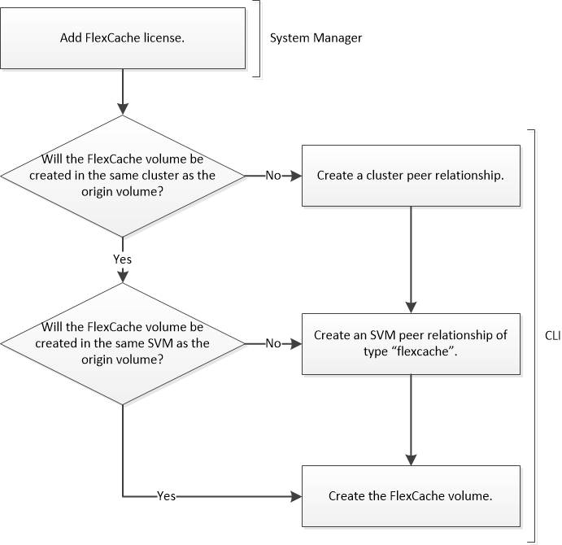

= FlexCache Volume erstellen-Workflow
:allow-uri-read: 
:icons: font
:imagesdir: ../media/

[role="lead"]
Sie müssen zuerst die FlexCache Lizenz vom System Manager installieren. Anschließend können Sie mithilfe der CLI ein FlexCache Volume im selben Cluster oder in einem Remote-Cluster erstellen.

Sie müssen ONTAP 9.5 oder höher ausführen.

Sie können FlexCache Volumes in demselben Cluster für eine beschleunigte Performance beim Zugriff auf Hot Volumes verwenden. FlexCache Volumes können in unterschiedlichen Clustern zur Verbesserung der Performance der clusterübergreifenden Datenverteilung verwendet werden.
