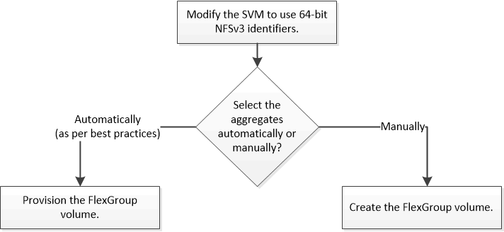

= Setup-Workflow für FlexGroup Volumes
:allow-uri-read: 
:icons: font
:imagesdir: ../media/

[role="lead"]
Sie können entweder ein FlexGroup Volume bereitstellen, bei dem ONTAP die Aggregate automatisch basierend auf den Best Practices für eine optimale Performance wählt. Alternativ können Sie ein FlexGroup Volume erstellen, indem Sie die Aggregate manuell auswählen und für den Datenzugriff konfigurieren.

.Was Sie benötigen
Die SVM muss mit NFS und SMB in die Liste der zugelassenen Protokolle für die SVM aufgenommen worden sein.

.Über diese Aufgabe
Ein FlexGroup-Volume kann automatisch nur auf Clustern mit maximal vier Nodes bereitgestellt werden. Bei Clustern mit mehr als vier Nodes müssen Sie ein FlexGroup Volume manuell erstellen.
