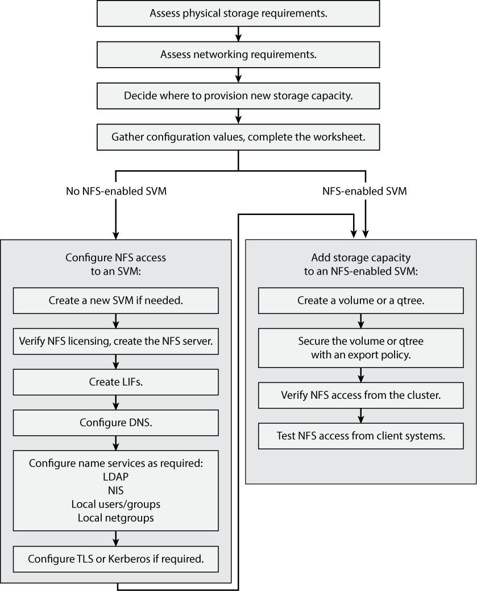

= NFS-Konfigurationsworkflow
:allow-uri-read: 
:icons: font
:imagesdir: ../media/

[role="lead"]
Bei der Konfiguration von NFS müssen die Anforderungen an physischen Storage und Netzwerk geprüft werden. Anschließend muss ein Workflow ausgewählt werden, der speziell auf Ihre Zielkonfiguration zugeschnitten ist: NFS-Zugriff auf eine neue oder vorhandene SVM wird konfiguriert, oder ein Volume oder qtree muss einer vorhandenen SVM hinzugefügt werden, die bereits vollständig für NFS-Zugriff konfiguriert ist.

