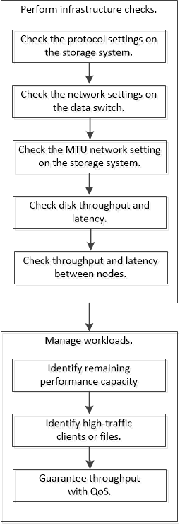

= Performance-Management-Workflow
:allow-uri-read: 
:icons: font
:imagesdir: ../media/

[role="lead"]
Sobald Sie ein Performance-Problem erkannt haben, können Sie Ihre Infrastruktur mit einigen grundlegenden Diagnosetprüfungen durchführen, um offensichtliche Konfigurationsfehler auszuschließen. Wenn diese das Problem nicht lokalisieren, können Sie sich mit dem Workload-Management-Problemen in die Lage geben.

