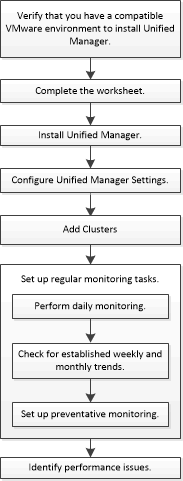

= Workflow-Übersicht zur Performance-Überwachung und Wartung
:allow-uri-read: 
:icons: font
:imagesdir: ../media/

[role="lead"]
Zur Überwachung und Aufrechterhaltung der Cluster-Performance müssen die Active IQ Unified Manager Software installiert, grundlegende Monitoring-Aufgaben eingerichtet, Performance-Probleme erkannt und nach Bedarf Anpassungen vorgenommen werden.

