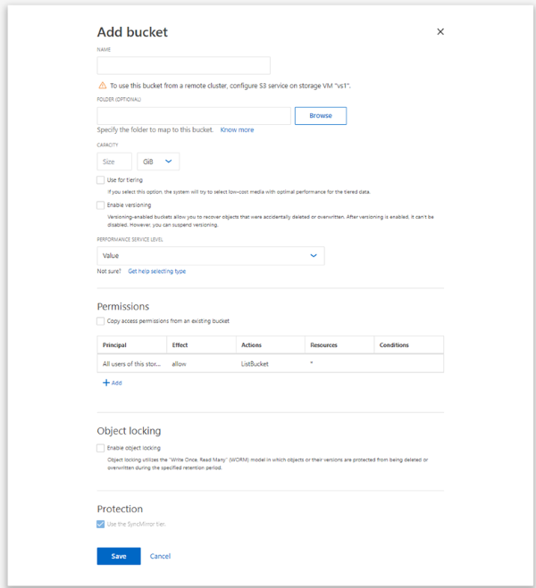

= Ein ONTAP S3-Bucket auf einem gespiegelten oder nicht gespiegelten Aggregat in einer MetroCluster Konfiguration erstellen
:allow-uri-read: 
:icons: font
:imagesdir: ../media/

[role="lead"]
Ab ONTAP 9.14.1 ist es möglich, einen Bucket auf einem gespiegelten oder nicht gespiegelten Aggregat in MetroCluster FC- und IP-Konfigurationen bereitzustellen.

.Über diese Aufgabe
* Standardmäßig werden Buckets auf gespiegelten Aggregaten bereitgestellt.
* Die gleichen Bereitstellungsrichtlinien, die in link:create-bucket-task.html["Einen Bucket erstellen"] beschrieben wurden, gelten auch für die Erstellung eines Buckets in einer MetroCluster Umgebung.
* Die folgenden S3-Objektspeicherfunktionen werden in MetroCluster Umgebungen *nicht* unterstützt:
+
** SnapMirror S3
** S3 Bucket Lebenszyklusmanagement
** S3 Objektsperre im *Compliance* Modus
+

NOTE: Die S3 Objektsperre im *Governance* Modus wird unterstützt.

** Lokales FabricPool Tiering

.Bevor Sie beginnen
Eine SVM mit einem S3-Server muss bereits vorhanden sein.

[[process-to-create-buckets]]
== Prozess zum Erstellen von Buckets

[role="tabbed-block"]
====
.CLI
--
. Wenn Sie Aggregate und FlexGroup Komponenten selbst auswählen, ist die Berechtigungsstufe „Erweitert“ erforderlich (ansonsten ist die Administratorberechtigung ausreichend): `set -privilege advanced`
. Einen Bucket erstellen:
+
`vserver object-store-server bucket create -vserver <svm_name> -bucket <bucket_name> [-size integer[KB|MB|GB|TB|PB]] [-use-mirrored-aggregates true/false]`

+
Die  `-use-mirrored-aggregates` Option wird auf  `true` oder  `false` gesetzt, abhängig davon, ob ein gespiegeltes oder ein nicht gespiegeltes Aggregat verwendet werden soll.

+

NOTE: Standardmäßig ist die `-use-mirrored-aggregates` Option auf `true` eingestellt.

+
** Der SVM-Name muss eine Daten-SVM sein.
** Wenn Sie keine Optionen angeben, erstellt ONTAP einen 800GB-Bucket, wobei die Serviceebene auf die höchste für Ihr System verfügbare Ebene eingestellt ist.
** Wenn ONTAP einen Bucket basierend auf Leistung oder Nutzung erstellen soll, kann eine der folgenden Optionen verwendet werden:
+
*** Service Level
+
Die  `-storage-service-level` Option ist mit einem der folgenden Werte anzugeben:  `value`,  `performance` oder  `extreme`.

*** Tiering
+
Die Option  `-used-as-capacity-tier true` einschließen.

** Wenn Sie die Aggregate angeben möchten, auf denen das zugrunde liegende FlexGroup Volume erstellt werden soll, stehen die folgenden Optionen zur Verfügung:
+
*** Der  `-aggr-list`Parameter gibt die Liste der Aggregate an, die für FlexGroup Volume-Bestandteile verwendet werden.
+
Jeder Eintrag in der Liste erstellt einen Bestandteil auf dem angegebenen Aggregat. Ein Aggregat kann mehrfach angegeben werden, sodass mehrere Bestandteile auf dem Aggregat erstellt werden.

+
Für eine gleichbleibende Leistung über das FlexGroup Volume hinweg müssen alle Aggregate den gleichen Festplattentyp und die gleiche RAID-Gruppenkonfiguration verwenden.

*** Der  `-aggr-list-multiplier`Parameter gibt an, wie oft die mit dem  `-aggr-list`Parameter aufgeführten Aggregate beim Erstellen eines FlexGroup Volume durchlaufen werden.
+
Der Standardwert des  `-aggr-list-multiplier` Parameters ist 4.

. Bei Bedarf kann eine QoS-Richtliniengruppe hinzugefügt werden:
+
`vserver object-store-server bucket modify -bucket _bucket_name_ -qos-policy-group _qos_policy_group_`

. Bucket-Erstellung überprüfen:
+
`vserver object-store-server bucket show [-instance]`

.Beispiel
Das folgende Beispiel erstellt einen Bucket für SVM vs1 mit einer Größe von 1 TB auf einem gespiegelten Aggregat:

[listing]
----
cluster-1::*> vserver object-store-server bucket create -vserver svm1.example.com -bucket testbucket  -size 1TB -use-mirrored-aggregates true
----
--
.System Manager
--
. Einen neuen Bucket auf einer S3-fähigen Storage-VM hinzufügen.
+
.. Klicken Sie auf *Speicher > Buckets* und anschließend auf *Hinzufügen*.
.. Einen Namen eingeben, die Speicher-VM auswählen und eine Größe angeben.
+
Standardmäßig wird der Bucket auf einem gespiegelten Aggregat bereitgestellt. Wenn ein Bucket auf einem nicht gespiegelten Aggregat erstellt werden soll, sind unter *Weitere Optionen* das Kontrollkästchen *SyncMirror-Ebene verwenden* unter *Schutz* zu deaktivieren, wie in der folgenden Abbildung gezeigt:

+

+
*** Wenn Sie jetzt auf *Speichern* klicken, wird ein Bucket mit diesen Standardeinstellungen erstellt:
+
**** Benutzern wird kein Zugriff auf den Bucket gewährt, es sei denn, es sind bereits Gruppenrichtlinien aktiv.
+

NOTE: Sie sollten den S3 Root-Benutzer nicht zur Verwaltung des ONTAP Objektspeichers und zur Freigabe seiner Berechtigungen verwenden, da dieser uneingeschränkten Zugriff auf den Objektspeicher hat. Stattdessen empfiehlt es sich, einen Benutzer oder eine Gruppe mit administrativen Berechtigungen zu erstellen, die Sie zuweisen.

**** Ein Servicequalitätsniveau (Leistung), das für Ihr System das höchstmögliche verfügbare ist.

*** Sie können auf *Weitere Optionen* klicken, um Benutzerberechtigungen und Leistungsniveau beim Konfigurieren des Buckets festzulegen, oder diese Einstellungen später ändern.
+
**** Benutzer und Gruppen müssen bereits erstellt worden sein, bevor über *Weitere Optionen* deren Berechtigungen konfiguriert werden können.
**** Wenn Sie den S3 Objektspeicher für FabricPool Tiering verwenden möchten, empfiehlt es sich, die Option *Für Tiering verwenden* (kostengünstige Medien mit optimaler Leistung für die gestaffelten Daten) statt eines Leistungs-Servicelevels auszuwählen.

. In S3-Client-Apps (einem anderen ONTAP-System oder einer externen Drittanbieter-App) kann der Zugriff auf den neuen Bucket durch Eingabe des Folgenden überprüft werden:
+
** Das S3-Server-CA-Zertifikat.
** Der Zugriffsschlüssel und der geheime Schlüssel des Benutzers.
** Der FQDN-Name des S3-Servers und der Bucket-Name.

--
====