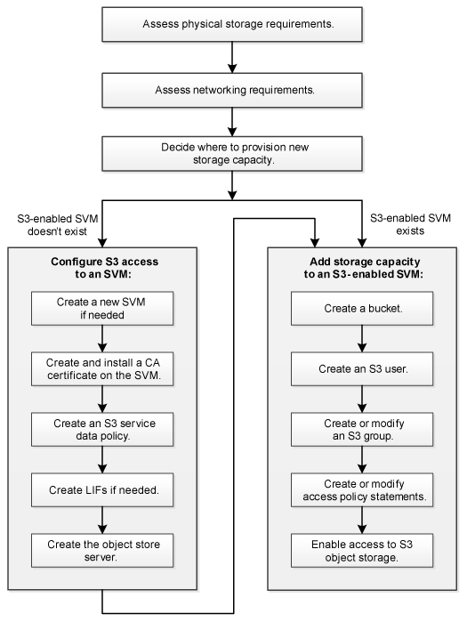

= S3-Konfigurationsworkflow
:allow-uri-read: 
:icons: font
:imagesdir: ../media/

[role="lead"]
Bei der Konfiguration von S3 geht es darum, physische Storage- und Netzwerkanforderungen zu bewerten, und anschließend einen spezifischen Workflow auszuwählen: S3-Zugriff auf eine neue oder vorhandene SVM zu konfigurieren oder einen Bucket und Benutzer zu einer vorhandenen SVM hinzuzufügen, die bereits vollständig für S3-Zugriff konfiguriert ist.

Wenn Sie mit System Manager S3-Zugriff auf eine neue Storage-VM konfigurieren, müssen Sie Zertifikat- und Netzwerkinformationen eingeben. Die Storage-VM und der S3-Objekt-Storage-Server werden in einem Vorgang erstellt.

