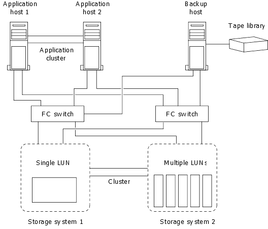

= Wie Sie ein Host Backup-System mit dem primären Storage-System verbinden können
:allow-uri-read: 
:icons: font
:imagesdir: ../media/

[role="lead"]
Sie können SAN-Systeme über einen separaten Backup-Host auf Tape sichern, um Performance-Einbußen beim Applikations-Host zu vermeiden.

Es muss zwingend notwendig sein, dass SAN- und NAS-Daten für Backup-Zwecke getrennt gehalten werden. Die Abbildung unten zeigt die empfohlene physische Konfiguration für ein Host-Backup-System auf dem primären Speichersystem. Sie müssen Volumes nur als SAN konfigurieren. LUNs sind auf ein einzelnes Volume beschränkt oder die LUNs können über mehrere Volumes oder Storage-Systeme verteilt werden.

Volumes auf einem Host können aus einer einzelnen LUN bestehen, die vom Storage-System zugeordnet ist, oder aus mehreren LUNs mit einem Volume Manager, wie VxVM auf HP-UX Systemen.
