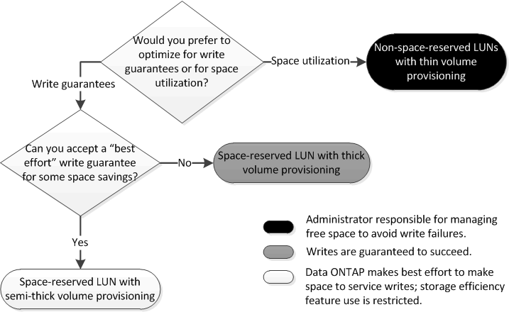

= Ermitteln Sie die richtige Kombination aus Volume- und LUN-Konfiguration für Ihre Umgebung
:allow-uri-read: 
:icons: font
:imagesdir: ../media/

[role="lead"]
Durch das Beantworten einiger grundlegender Fragen zu Ihrer Umgebung können Sie die beste Konfiguration von FlexVol Volumes und LUNs für Ihre Umgebung ermitteln.

.Über diese Aufgabe
Sie können LUN- und Volume-Konfigurationen für maximale Storage-Auslastung und für die Sicherheit von Schreibgarantien optimieren. Basierend auf Ihren Anforderungen an die Storage-Auslastung und der Möglichkeit, freien Speicherplatz schnell zu überwachen und aufzufüllen, müssen Sie das FlexVol Volume und die LUN-Volumes bestimmen, die für Ihre Installation geeignet sind.

[NOTE]
====
Sie brauchen kein separates Volume für jede LUN.

====
.Schritt
. Verwenden Sie den folgenden Entscheidungsbaum, um die beste Kombination aus Volume- und LUN-Konfiguration für Ihre Umgebung zu ermitteln:
+

