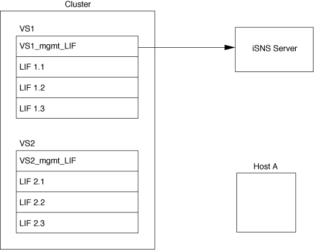
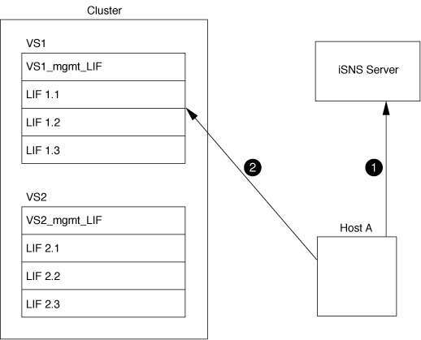

= Internet Storage Name Service (iSNS)
:allow-uri-read: 
:icons: font
:imagesdir: ../media/

[role="lead"]
Der Internet Storage Name Service (iSNS) ist ein Protokoll, das die automatische Erkennung und Verwaltung von iSCSI-Geräten in einem TCP/IP-Speichernetzwerk ermöglicht. Ein iSNS-Server speichert Informationen über aktive iSCSI-Geräte im Netzwerk, einschließlich ihrer IP-Adressen, iSCSI-Knotennamen IQN's und Portalgruppen.

Sie können einen iSNS-Server von einem Drittanbieter beziehen. Wenn Sie in Ihrem Netzwerk einen iSNS-Server konfiguriert und für die Verwendung durch den Initiator und das Ziel aktiviert haben, können Sie die Management-LIF für eine Storage Virtual Machine (SVM) verwenden, um alle iSCSI-LIFs für diese SVM auf dem iSNS-Server zu registrieren. Nach Abschluss der Registrierung kann der iSCSI-Initiator den iSNS-Server abfragen, um alle LIFs für diese bestimmte SVM zu ermitteln.

Wenn Sie sich für die Verwendung eines iSNS-Dienstes entscheiden, müssen Sie sicherstellen, dass Ihre Storage Virtual Machines (SVMs) ordnungsgemäß bei einem Internet Storage Name Service (iSNS)-Server registriert sind.

Wenn Sie keinen iSNS-Server im Netzwerk haben, müssen Sie jedes Ziel manuell so konfigurieren, dass es für den Host sichtbar ist.

== Was macht ein iSNS-Server

Ein iSNS-Server verwendet das iSNS-Protokoll (Internet Storage Name Service), um Informationen über aktive iSCSI-Geräte im Netzwerk zu erhalten, einschließlich ihrer IP-Adressen, iSCSI-Node-Namen (IQNs) und Portalgruppen.

Das iSNS-Protokoll ermöglicht die automatische Erkennung und Verwaltung von iSCSI-Geräten in einem IP-Speichernetzwerk. Ein iSCSI-Initiator kann den iSNS-Server abfragen, um iSCSI-Zielgeräte zu ermitteln.

NetApp bietet keine iSNS Server an oder verkauft diese weiter. Sie können diese Server von einem von NetApp unterstützten Anbieter beziehen.

== Interaktion von SVMs mit einem iSNS-Server

Der iSNS-Server kommuniziert über die SVM-Management-LIF mit jeder Storage Virtual Machine (SVM). Die Management-LIF registriert alle iSCSI-Zielknotennamen, -Alias und -Portalinformationen beim iSNS-Service für eine bestimmte SVM.

Im folgenden Beispiel verwendet die SVM „`VS1`“ die SVM-Management-LIF „`VS1_mgmt_LIF`“, um sich beim iSNS-Server zu registrieren. Während der iSNS-Registrierung sendet eine SVM alle iSCSI-LIFs über die SVM-Management-LIF an den iSNS-Server. Nach Abschluss der iSNS-Registrierung enthält der iSNS-Server eine Liste aller LIFs, die iSCSI in „`VS1`“ bereitstellen. Wenn ein Cluster mehrere SVMs enthält, muss sich jede SVM einzeln beim iSNS-Server registrieren, um den iSNS-Service nutzen zu können.

Im nächsten Beispiel kann Host A, nachdem der iSNS-Server die Registrierung beim Ziel abgeschlossen hat, alle LIFs für „`VS1`“ über den iSNS-Server ermitteln, wie in Schritt 1 angegeben. Nachdem Host A die Erkennung der LIFs für „`VS1`“ abgeschlossen hat, kann Host A wie in Schritt 2 gezeigt eine Verbindung zu jedem der LIFs in „`VS1`“ herstellen. Host A erkennt keine der LIFs in „`VS2`“, bis sich die Management-LIF „`VS2_mgmt_LIF`“ für „`VS2`“ beim iSNS-Server registriert hat.

Wenn Sie jedoch die Schnittstellenzugriffslisten definieren, kann der Host nur die definierten LIFs in der Schnittstellenzugangsliste verwenden, um das Ziel zu erreichen.

Nach der anfänglichen Konfiguration von iSNS aktualisiert ONTAP den iSNS-Server automatisch, wenn sich die SVM-Konfigurationseinstellungen ändern.

Zwischen dem Zeitpunkt, zu dem Sie die Konfigurationsänderungen vornehmen, und dem Zeitpunkt, an dem ONTAP das Update an den iSNS-Server sendet, kann es zu einer Verzögerung von einigen Minuten kommen. Sofortige Aktualisierung der iSNS-Informationen auf dem iSNS-Server erzwingen: `vserver iscsi isns update`

== Befehle zum Verwalten von iSNS

ONTAP bietet Befehle zur Verwaltung Ihres iSNS-Service.

|===

| Ihr Ziel ist | Befehl 

 a| 
Konfigurieren Sie einen iSNS-Dienst
 a| 
`vserver iscsi isns create`

 a| 
Starten Sie einen iSNS-Dienst
 a| 
`vserver iscsi isns start`

 a| 
Ändern eines iSNS-Dienstes
 a| 
`vserver iscsi isns modify`

 a| 
ISNS-Servicekonfiguration anzeigen
 a| 
`vserver iscsi isns show`

 a| 
Aktualisierung der registrierten iSNS-Informationen erzwingen
 a| 
`vserver iscsi isns update`

 a| 
Stoppen Sie einen iSNS-Dienst
 a| 
`vserver iscsi isns stop`

 a| 
Entfernen Sie einen iSNS-Dienst
 a| 
`vserver iscsi isns delete`

 a| 
Zeigen Sie die man-Page für einen Befehl an
 a| 
`man _command name_`

|===
Weitere Informationen finden Sie auf der man-Page für jeden Befehl.
