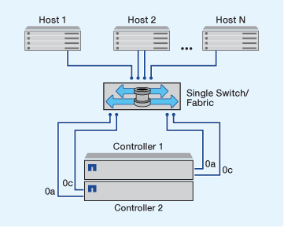

= Möglichkeiten zur Konfiguration von FC- und FC-NVMe-SAN-Hosts
:allow-uri-read: 
:icons: font
:imagesdir: ../media/

[role="lead"]
Es wird empfohlen, Ihre FC- und FC-NVMe-SAN-Hosts über HA-Paare und mindestens zwei Switches zu konfigurieren.  Sie bietet Redundanz auf Fabric- und Storage-Systemebene zur Unterstützung von Fehlertoleranz und unterbrechungsfreiem Betrieb. Sie können FC- oder FC-NVMe-SAN-Hosts nicht ohne Switch direkt an HA-Paare anschließen.

Kaskadierung, partielles Mesh, volles Mesh, Core-Edge und Director Fabrics sind branchenübliche Methoden, FC Switches mit einem Fabric zu verbinden. Alle werden unterstützt.  Die Verwendung heterogener FC Switch Fabrics wird nicht unterstützt, außer bei eingebetteten Blade-Switches.  Spezielle Ausnahmen sind in aufgeführt link:https://imt.netapp.com/matrix/["Interoperabilitäts-Matrix-Tool"^].  Eine Fabric kann aus einem oder mehreren Switches bestehen und die Storage-Controller mit mehreren Switches verbunden werden.

Mehrere Hosts, die verschiedene Betriebssysteme verwenden, z. B. Windows, Linux oder UNIX, können gleichzeitig auf die Storage Controller zugreifen.  Hosts erfordern, dass eine unterstützte Multipathing-Lösung installiert und konfiguriert ist. Unterstützte Betriebssysteme und Multipathing-Lösungen können im Interoperabilitäts-Matrix-Tool verifiziert werden.

== Multi-Fabric-FC- und FC-NVMe-Konfigurationen

In Multi-Fabric HA-Paar-Konfigurationen gibt es mindestens zwei Switches, die HA-Paare mit einem oder mehreren Hosts verbinden. Der Einfachheit halber werden im folgenden HA-Paar mit mehreren Fabrics nur zwei gezeigt, doch in jeder Multi-Fabric-Konfiguration können mindestens zwei Fabrics vorhanden sein.

Die FC-Ziel-Port-Nummern (0c, 0d, 1a, 1b) in den Abbildungen sind Beispiele. Die tatsächlichen Port-Nummern variieren je nach Modell des Storage-Node und ob Sie Erweiterungsadapter verwenden.

image::../media/scrn_en_drw_fc-32xx-multi-HA.png[Ha-Paar-Diagramm mit mehreren Fabrics]

== FC- und FC-NVMe-Konfigurationen in einem Fabric

Bei Einzel-Fabric-HA-Paar-Konfigurationen besteht ein Fabric, das beide Controller im HA-Paar mit einem oder mehreren Hosts verbindet. Da die Hosts und Controller über einen einzelnen Switch verbunden sind, sind HA-Paar-Konfigurationen in einem Fabric nicht vollständig redundant.

Die FC-Ziel-Port-Nummern (0a, 0c) in den Abbildungen sind Beispiele. Die tatsächlichen Port-Nummern variieren je nach Modell des Storage-Node und ob Sie Erweiterungsadapter verwenden.

Alle Plattformen, die FC-Konfigurationen unterstützen, unterstützen HA-Paar-Konfigurationen in einem Single-Fabric-Ansatz.

[NOTE]
====
link:../system-admin/single-node-clusters.html["Single-Node-Konfigurationen"] Die Empfehlungen sind nicht empfehlenswert, da sie nicht die Redundanz bieten, die zur Unterstützung von Fehlertoleranz und unterbrechungsfreiem Betrieb erforderlich ist.

====
.Verwandte Informationen
* Erfahren Sie, wie link:../san-admin/selective-lun-map-concept.html#determine-whether-slm-is-enabled-on-a-lun-map["Selektive LUN-Zuordnung (SLM)"] Beschränkt die Pfade, die für den Zugriff auf die LUNs verwendet werden, die sich im Besitz eines HA-Paars befinden.
* Erfahren Sie mehr über link:../san-admin/manage-lifs-all-san-protocols-concept.html["SAN LIFs"].

