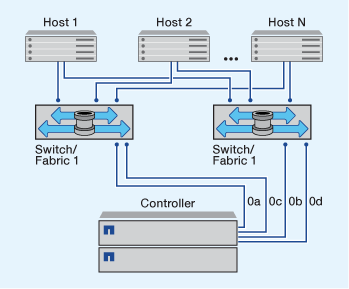

= Möglichkeiten zur Konfiguration von FC- und FC-NVMe-SAN-Hosts mit einzelnen Nodes
:allow-uri-read: 
:icons: font
:imagesdir: ../media/

[role="lead"]
Sie können FC- und FC-NVMe-SAN-Hosts mit einzelnen Nodes über eine oder mehrere Fabrics konfigurieren. N-Port ID Virtualization (NPIV) ist erforderlich und muss auf allen FC Switches in der Fabric aktiviert sein. Sie können ohne Verwendung eines FC-Switch keine FC- oder FC-NMVE SAN-Hosts direkt an einzelne Nodes anschließen.

Sie können FC- oder FC-NVMe-SAN-Hosts mit einzelnen Nodes über eine Single Fabric oder mehrere Fabrics konfigurieren. Die FC-Ziel-Ports (0a, 0c, 0b, 0d) in den Abbildungen sind Beispiele. Die tatsächlichen Port-Nummern variieren je nach Modell des Storage-Node und ob Sie Erweiterungsadapter verwenden.

== Single-Fabric-Single-Node-Konfigurationen

Bei Single-Fabric-Konfigurationen mit einem Node kann ein Switch einen einzelnen Node mit einem oder mehreren Hosts verbinden. Da es einen einzelnen Switch gibt, ist diese Konfiguration nicht vollständig redundant. Alle Hardware-Plattformen, die FC und FC-NVMe unterstützen Single-Fabric-Single-Node-Konfigurationen. Allerdings erfordert die FAS2240 Plattform den X1150A-R6 Expansion Adapter zur Unterstützung einer Single-Fabric-Konfiguration mit einem Node.

Die folgende Abbildung zeigt eine FAS2240 Single-Fabric-Konfiguration mit einem Node. In diesem Artikel werden die Storage Controller nebeneinander angezeigt, wie sie in der FAS2240-2 montiert werden. Für FAS2240-4 sind die Controller einen über dem anderen montiert. Für die beiden Modelle besteht kein Unterschied in der SAN-Konfiguration.

image::../media/scrn_en_drw_fc-2240-single.png[Diagramm mit einem Switch]

== Single Node-Konfigurationen in MultiFabric-Architektur

Bei Single-Node-Konfigurationen mit mehreren Fabrics müssen mindestens zwei Switches einen einzelnen Node mit einem oder mehreren Hosts verbinden. Die folgende Abbildung zeigt eine Single-Node-Konfiguration mit mehreren Fabrics und nur zwei Fabrics, wobei in jeder Konfiguration mit mehreren Fabric jedoch zwei oder mehr Fabrics möglich sind. In dieser Abbildung ist der Speicher-Controller im oberen Gehäuse montiert und das untere Gehäuse kann leer sein oder ein IOMX-Modul besitzen, wie in diesem Beispiel.

http://www.netapp.com/us/media/tr-4684.pdf["Technischer Bericht von NetApp 4684: Implementieren und Konfigurieren moderner SANs mit NVMe/FC"]
