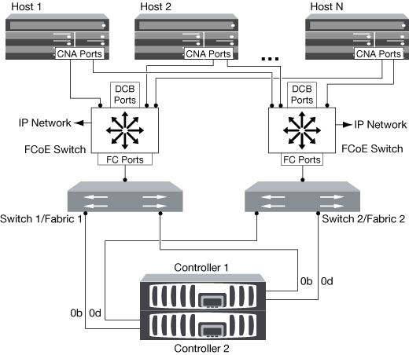

= Möglichkeiten zur FCoE-Konfiguration – Übersicht
:allow-uri-read: 
:icons: font
:imagesdir: ../media/

[role="lead"]
FCoE lässt sich mit FCoE Switches auf verschiedene Weise konfigurieren. Direct-Attached-Konfigurationen werden in FCoE nicht unterstützt.

Alle FCoE-Konfigurationen sind Dual Fabric-Systeme, vollständig redundant und erfordern Host-seitige Multipathing-Software. In allen FCoE-Konfigurationen können Sie im Pfad zwischen dem Initiator und dem Ziel mehrere FCoE- und FC-Switches bis zur maximalen Hop Count-Grenze verwenden. Um Switches miteinander zu verbinden, müssen auf den Switches eine Firmware-Version ausgeführt werden, die Ethernet-ISLs unterstützt. Jeder Host in einer FCoE-Konfiguration kann mit einem anderen Betriebssystem konfiguriert werden.

Für FCoE-Konfigurationen sind Ethernet Switches erforderlich, die explizit FCoE-Funktionen unterstützen. FCoE-Konfigurationen werden durch denselben Interoperabilitäts- und Qualitätssicherungsprozess wie FC Switches validiert. Unterstützte Konfigurationen sind in der Interoperabilitäts-Matrix aufgeführt. Einige der in diesen unterstützten Konfigurationen enthaltenen Parameter sind das Switch-Modell, die Anzahl der Switches, die in einer einzigen Fabric implementiert werden können, und die unterstützte Switch-Firmware-Version.

Die Port-Nummern der FC-Target-Erweiterungsadapter in den Abbildungen sind Beispiele. Die tatsächlichen Port-Nummern können variieren, je nach den Erweiterungssteckplätzen, in denen die FCoE Ziel-Erweiterungsadapter installiert sind.

== FCoE-Initiator zu FC-Ziel

Mit FCoE-Initiatoren (CNAs) können Sie Hosts mit beiden Controllern in einem HA-Paar über FCoE Switches an FC-Ziel-Ports verbinden. Der FCoE-Switch muss auch über FC-Ports verfügen. Der Host FCoE Initiator stellt immer eine Verbindung zum FCoE-Switch her. Der FCoE Switch kann eine direkte Verbindung zum FC-Ziel herstellen oder über FC-Switches eine Verbindung zum FC-Ziel herstellen.

In der folgenden Abbildung werden die Host-CNAs, die eine Verbindung zu einem FCoE-Switch herstellen, und dann vor der Verbindung zum HA-Paar mit einem FC-Switch angezeigt:

== FCoE-Initiator zu FCoE Target

Mithilfe von Host FCoE-Initiatoren (CNAs) können Hosts über FCoE-Switches auf beiden Controllern über ein HA-Paar mit den FCoE Ziel-Ports (auch als UTAs oder UTA2 bezeichnet) verbunden werden.

image::../media/scrn_en_drw_fcoe-end-to-end.png[FCoE-Initiator zu FCoE Target]

== FCoE-Initiator auf FCoE- und FC-Ziele

Mithilfe von Host FCoE-Initiatoren (CNAs) können Hosts über FCoE Switches auf beiden Controllern in einem HA-Paar an FCoE- und FC-Ziel-Ports (auch als UTAs oder UTA2 bezeichnet) angeschlossen werden.

image::../media/scrn_en_drw_fcoe-mixed.png[FCoE-Initiator auf FCoE- und FC-Ziele]

== FCoE wird mit IP-Storage-Protokollen kombiniert

Mithilfe von Host FCoE-Initiatoren (CNAs) können Hosts über FCoE-Switches auf beiden Controllern über ein HA-Paar mit den FCoE Ziel-Ports (auch als UTAs oder UTA2 bezeichnet) verbunden werden. FCoE-Ports können keine herkömmliche Link-Aggregation zu einem einzelnen Switch verwenden. Cisco Switches unterstützen eine besondere Art von Link-Aggregation (Virtual Port Channel), die FCoE unterstützt. Ein Virtual Port Channel sammelt individuelle Links zu zwei Switches. Sie können virtuelle Port-Kanäle auch für andere Ethernet-Datenverkehr verwenden. Ports, die für andere Datenverkehr als FCoE verwendet werden, einschließlich NFS, SMB, iSCSI und anderer Ethernet-Datenverkehr, können regelmäßige Ethernet-Ports an den FCoE Switches nutzen.

image::../media/scrn_en_drw_fcoe-mixed-ethernet.png[FCoE wird mit IP-Storage-Protokollen kombiniert]
