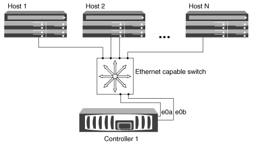

= Möglichkeiten zur Konfiguration von iSCSI-SAN-Hosts mit einzelnen Nodes
:allow-uri-read: 
:icons: font
:imagesdir: ../media/

[role="lead"]
Sie können die iSCSI-SAN-Hosts so konfigurieren, dass sie eine direkte Verbindung zu einem einzelnen Knoten oder über einen oder mehrere IP-Switches herstellen. Legen Sie fest, ob Sie eine Single-Switch-Konfiguration wünschen, die nicht vollständig redundant ist, oder eine Multi-Switch-Konfiguration, die vollständig redundant ist.

Sie können iSCSI SAN-Hosts in einer Direct-Attached-, Single-Switch- oder Multi-Switch-Umgebung konfigurieren. Wenn mehrere Hosts mit dem Node verbunden sind, kann jeder Host mit einem anderen Betriebssystem konfiguriert werden. Für Konfigurationen mit einem oder mehreren Netzwerken kann der Node mehrere iSCSI-Verbindungen zum Switch herstellen, allerdings ist Multipathing-Software mit ALUA erforderlich.

[NOTE]
====
Wenn mehrere Pfade vom Host zum Controller vorhanden sind, muss ALUA auf dem Host aktiviert sein.

====

== Direct-Attached Single Node-Konfigurationen

Bei Direct-Attached-Konfigurationen sind ein oder mehrere Hosts direkt mit dem Node verbunden.

image::../media/scrn_en_drw_fc-302020-direct-sing-on.png[Abbildung von direkt verbundenen Controllern mit einem oder mehreren direkt mit dem Node verbundenen Hosts]

== Single-Network-Konfiguration mit Single Node-Konfiguration

In Single-Network-Konfigurationen mit einem oder mehreren Hosts wird über einen Switch ein Node mit einem oder mehreren Hosts verbunden. Da es einen einzelnen Switch gibt, ist diese Konfiguration nicht vollständig redundant.

== Single Node-Konfigurationen in mehreren Netzwerken

Bei Konfigurationen mit einem einzigen Netzwerk mit mehreren Nodes werden mindestens zwei Switches einen einzelnen Node mit einem oder mehreren Hosts verbunden. Da es mehrere Switches gibt, ist diese Konfiguration vollständig redundant.

image::../media/scrn-en-drw-iscsi-multinw-singlen.gif[Scrn en drw iscsi Mulrow Singlen]
