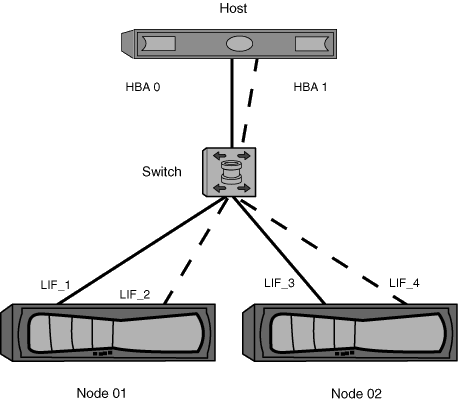

= Einzel-Fabric-Zoning
:allow-uri-read: 
:icons: font
:imagesdir: ../media/

[role="lead"]
In einer Einzel-Fabric-Konfiguration können Sie weiterhin jeden Host-Initiator mit jedem Storage Node verbinden. Auf dem Host wird Multipathing-Software benötigt, um mehrere Pfade verwalten zu können. Jeder Host sollte zwei Initiatoren für Multipathing haben, um Ausfallsicherheit in der Lösung zu gewährleisten.

Jeder Initiator sollte von jedem Node, auf den der Initiator zugreifen kann, mindestens eine LIF besitzen. Das Zoning sollte mindestens einen Pfad vom Host-Initiator zum HA-Paar der Nodes im Cluster zulassen, um einen Pfad für die LUN-Konnektivität bereitzustellen. Dies bedeutet, dass jeder Initiator auf dem Host in seiner Zonenkonfiguration möglicherweise nur über ein Ziel-LIF pro Node verfügt. Wenn Multipathing zum selben Node oder zu mehreren Nodes im Cluster erforderlich ist, dann verfügt jeder Node über mehrere LIFs in seiner Zonenkonfiguration. Dies ermöglicht es dem Host, weiterhin auf seine LUNs zuzugreifen, wenn ein Node ausfällt oder ein Volume mit der LUN auf einen anderen Node verschoben wird. Dafür müssen auch die Reporting-Nodes entsprechend eingestellt werden.

Single-Fabric-Konfigurationen werden unterstützt, jedoch nicht als hochverfügbar angesehen. Der Ausfall einer einzelnen Komponente kann zum Verlust des Zugriffs auf Daten führen.

In der folgenden Abbildung hat der Host zwei Initiatoren und führt die Multipathing-Software aus. Es gibt zwei Zonen:

[NOTE]
====
Die in dieser Abbildung verwendete Namenskonvention ist nur eine Empfehlung zu einer möglichen Namenskonvention, die Sie für Ihre ONTAP Lösung verwenden können.

====
* Zone 1: HBA 0, LIF_1 und LIF_3
* Zone 2: HBA 1, LIF_2 und LIF_4

Wenn die Konfiguration mehr Nodes enthielt, wären die LIFs für die zusätzlichen Nodes in diesen Zonen enthalten.

In diesem Beispiel könnten Sie auch alle vier LIFs in jeder Zone enthalten. In diesem Fall wären die Zonen wie folgt:

* Zone 1: HBA 0, LIF_1, LIF_2, LIF_3 und LIF_4
* Zone 2: HBA 1, LIF_1, LIF_2, LIF_3 und LIF_4

[NOTE]
====
Das Host-Betriebssystem und die Multipathing-Software müssen die Anzahl der unterstützten Pfade unterstützen, die zum Zugriff auf die LUNs auf den Nodes verwendet werden. Informationen zur Bestimmung der Anzahl der Pfade für den Zugriff auf die LUNs auf Nodes finden Sie im Abschnitt über die SAN-Konfigurationsbeschränkungen.

====
https://hwu.netapp.com["NetApp Hardware Universe"^]
