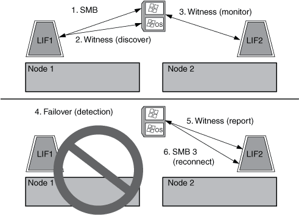

= Funktionsweise des Zeugenprotokolls
:allow-uri-read: 
:icons: font
:imagesdir: ../media/

[role="lead"]
ONTAP implementiert das Witness-Protokoll mithilfe von SFO-Partner eines Node als Witness. Bei einem Ausfall erkennt der Partner den Ausfall schnell und benachrichtigt den SMB Client.

Das Witness-Protokoll bietet mithilfe des folgenden Verfahrens einen verbesserten Failover:

. Wenn der Applikations-Server eine kontinuierlich verfügbare SMB-Verbindung zu Node1 herstellt, informiert der CIFS-Server den Applikationsserver darüber, dass Witness verfügbar ist.
. Der Anwendungsserver fordert die IP-Adressen des Witness-Servers von Node1 an und erhält eine Liste von Node2 (dem SFO-Partner) Daten-LIF-IP-Adressen, die der Storage Virtual Machine (SVM) zugewiesen sind.
. Der Anwendungsserver wählt eine der IP-Adressen aus, erstellt eine Witness-Verbindung zu Node2 und meldet sich an, benachrichtigt zu werden, wenn die ständig verfügbare Verbindung auf Node1 verschoben werden muss.
. Wenn auf Node1 ein Failover-Ereignis eintritt, erleichtert Witness Failover-Ereignisse, ist jedoch nicht an der Rückgabe beteiligt.
. Witness erkennt das Failover-Ereignis und benachrichtigt den Applikationsserver über die Witness Verbindung, dass die SMB-Verbindung zu Node2 verschoben werden muss.
. Der Anwendungsserver verschiebt die SMB-Sitzung auf Node2 und stellt die Verbindung ohne Unterbrechung des Client-Zugriffs wieder her.

