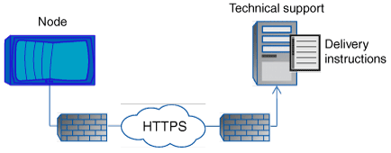

= Wie AutoSupport OnDemand Anweisungen zur Bereitstellung durch den technischen Support erhält
:allow-uri-read: 
:icons: font
:imagesdir: ../media/

[role="lead"]
AutoSupport OnDemand kommuniziert regelmäßig mit dem technischen Support, um Lieferanweisungen für das Senden, erneute Senden und Ablehnen von AutoSupport Meldungen zu erhalten sowie große Dateien auf die NetApp Support Website hochzuladen. AutoSupport OnDemand ermöglicht das bedarfsgerechte Senden von AutoSupport Meldungen anstatt auf die Ausführung des wöchentlichen AutoSupport Jobs zu warten.

AutoSupport OnDemand besteht aus den folgenden Komponenten:

* AutoSupport OnDemand-Client, der auf jedem Node ausgeführt wird
* AutoSupport OnDemand Service im technischen Support

Der AutoSupport OnDemand Client fragt regelmäßig den AutoSupport OnDemand Service ab, um Anweisungen zum technischen Support zu erhalten. Beispielsweise kann der technische Support den AutoSupport OnDemand Service verwenden, um eine neue AutoSupport Meldung zu erstellen. Wenn der AutoSupport OnDemand-Client den AutoSupport OnDemand-Service abfragt, erhält der Client die Lieferanweisungen und sendet die neue AutoSupport Meldung nach Bedarf.

AutoSupport OnDemand ist standardmäßig aktiviert. AutoSupport OnDemand verlässt sich jedoch auf einige AutoSupport-Einstellungen, um die Kommunikation mit dem technischen Support fortzusetzen. AutoSupport OnDemand kommuniziert automatisch mit dem technischen Support, wenn die folgenden Anforderungen erfüllt sind:

* AutoSupport ist aktiviert.
* AutoSupport wurde konfiguriert, um Meldungen an den technischen Support zu senden.
* AutoSupport ist für die Verwendung des HTTPS-Transportprotokolls konfiguriert.

Der AutoSupport OnDemand-Client sendet HTTPS-Anforderungen an denselben technischen Support-Standort, an den AutoSupport Meldungen gesendet werden. Der AutoSupport OnDemand-Client akzeptiert keine eingehenden Verbindungen.

[NOTE]
====
AutoSupport OnDemand kommuniziert über das „`AutoSupport`“ Benutzerkonto mit dem technischen Support. ONTAP verhindert, dass Sie dieses Konto löschen.

====
Wenn Sie AutoSupport OnDemand deaktivieren, aber AutoSupport aktiviert lassen möchten, verwenden Sie den Befehl: Link:https://docs.netapp.com/us-en/ontap-cli-95/system-node-autosupport-modify.html#parameters[`system node autosupport modify -ondemand-state disable`].

Die folgende Abbildung zeigt, wie AutoSupport OnDemand HTTPS-Anfragen an den technischen Support sendet, um Lieferanweisungen zu erhalten.

Die Lieferanweisungen können auch Anfragen von AutoSupport zu folgenden Aufgaben enthalten:

* Generieren neuer AutoSupport Meldungen.
+
Der technische Support fordert möglicherweise neue AutoSupport Meldungen zur Unterstützung der Problembehebung an.

* Generieren neuer AutoSupport Meldungen, die Core Dump-Dateien oder Performance-Archivdateien auf die NetApp Support Site hochladen.
+
Der technische Support fordert möglicherweise Core Dump- oder Performance-Archivdateien an, um Probleme frühzeitig zu erkennen.

* Zuvor erzeugte AutoSupport Meldungen erneut übertragen.
+
Diese Anforderung tritt automatisch ein, wenn aufgrund eines Lieferfehlers keine Meldung empfangen wurde.

* Deaktivieren der Bereitstellung von AutoSupport Meldungen für bestimmte Trigger-Ereignisse.
+
Der technische Support deaktiviert möglicherweise die Bereitstellung von Daten, die nicht verwendet werden.

