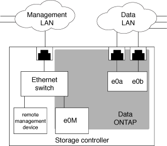

= Isolierung des Managementnetzwerk-Traffic
:allow-uri-read: 
:icons: font
:imagesdir: ../media/

[role="lead"]
Es handelt sich um eine Best Practice, um SP/BMC und die E0M Management-Schnittstelle in einem für Management-Datenverkehr dedizierten Subnetz zu konfigurieren. Ein laufender Datenverkehr über das Managementnetzwerk kann zu Performance-Einbußen und Routing-Problemen führen.

Der Management-Ethernet-Port an den meisten Storage Controllern (angezeigt durch ein Schraubenschlüsselsymbol auf der Rückseite des Chassis) ist mit einem internen Ethernet-Switch verbunden. Der interne Switch bietet Konnektivität zum SP/BMC sowie zur E0M Managementoberfläche, über die Sie mittels TCP/IP-Protokollen wie Telnet, SSH und SNMP auf das Storage-System zugreifen können.

Wenn Sie das Remote-Management-Gerät und E0M verwenden möchten, müssen Sie diese in demselben IP-Subnetz konfigurieren. Da es sich hierbei um Schnittstellen mit niedriger Bandbreite handelt, empfiehlt es sich, SP/BMC und E0M in einem für den Management-Datenverkehr dedizierten Subnetz zu konfigurieren.

Wenn Sie den Verwaltungsdatenverkehr nicht isolieren können oder wenn Ihr dediziertes Managementnetzwerk ungewöhnlich groß ist, sollten Sie versuchen, das Volumen des Netzwerkdatenverkehrs so gering wie möglich zu halten. Übermäßiger Ingress-Broadcast- oder Multicast-Datenverkehr kann die SP/BMC-Leistung beeinträchtigen.

[NOTE]
====
Einige Storage Controller, z. B. die AFF A800, verfügen über zwei externe Ports: Einen für BMC und die andere für E0M. Für diese Controller müssen BMC und E0M in demselben IP-Subnetz nicht konfiguriert werden.

====