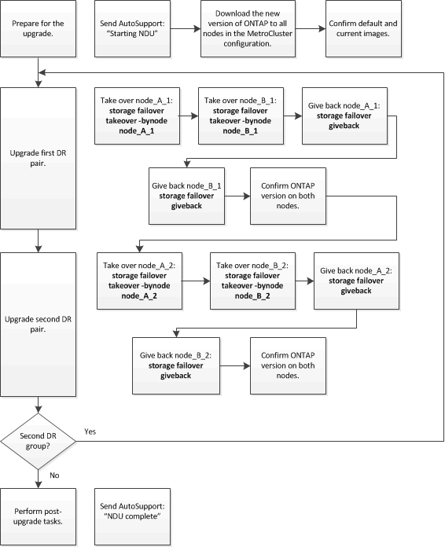

= Manuelles, unterbrechungsfreies ONTAP Upgrade einer MetroCluster Konfiguration mit vier oder acht Nodes über die Befehlszeilenschnittstelle
:allow-uri-read: 
:icons: font
:imagesdir: ../media/

[role="lead"]
Das manuelle Update zur Aktualisierung oder Herabstufung einer MetroCluster-Konfiguration mit vier oder acht Nodes beinhaltet die Vorbereitung des Updates, die Aktualisierung der DR-Paare in jeder der ein oder zwei DR-Gruppen gleichzeitig und die Durchführung einiger Aufgaben nach dem Update.

* Dieser Task gilt für die folgenden Konfigurationen:
+
** MetroCluster FC- oder IP-Konfigurationen mit vier Nodes und ONTAP 9.2 oder älter
** MetroCluster FC-Konfigurationen mit acht Nodes, unabhängig von der ONTAP Version

* Wenn Sie über eine MetroCluster-Konfiguration mit zwei Nodes verfügen, verwenden Sie diese Vorgehensweise nicht.
* Die folgenden Aufgaben beziehen sich auf die alten und neuen Versionen von ONTAP.
+
** Beim Upgrade handelt es sich bei der alten Version um eine vorherige Version von ONTAP, deren Versionsnummer niedriger als die neue Version von ONTAP ist.
** Beim Downgrade handelt es sich bei der alten Version um eine neuere Version von ONTAP, deren Versionsnummer höher ist als bei der neuen Version von ONTAP.

* Diese Aufgabe verwendet den folgenden grundlegenden Workflow:
+

== Unterschiede beim Aktualisieren der Software auf einer MetroCluster-Konfiguration mit acht oder vier Nodes

Das MetroCluster-Softwareupdate unterscheidet sich je nachdem, ob es acht oder vier Knoten in der MetroCluster-Konfiguration gibt.

Eine MetroCluster Konfiguration besteht aus einer oder zwei DR-Gruppen. Jede DR-Gruppe besteht aus zwei HA-Paaren – ein HA-Paar auf jedem MetroCluster Cluster. Eine MetroCluster mit acht Nodes umfasst zwei DR-Gruppen:

image::../media/mcc_dr_groups_8_node.gif[Diagramm der MetroCluster-Konfiguration mit acht Nodes]

Beim Update der MetroCluster Software müssen Sie jeweils eine DR-Gruppe aktualisieren oder verkleinern.

MetroCluster Konfigurationen mit vier Nodes:

. DR-Gruppe 1 aktualisieren:
+
.. Node_A_1 und Node_B_1 aktualisieren.
.. Node_A_2 und Node_B_2 aktualisieren.

Bei MetroCluster-Konfigurationen mit acht Nodes führen Sie zweimal die Aktualisierung der DR-Gruppe durch:

. DR-Gruppe 1 aktualisieren:
+
.. Node_A_1 und Node_B_1 aktualisieren.
.. Node_A_2 und Node_B_2 aktualisieren.

. DR-Gruppe 2 aktualisieren:
+
.. Aktualisieren von Node_A_3 und Node_B_3.
.. Aktualisieren von Node_A_4 und Node_B_4.

== Aktualisierung einer MetroCluster DR-Gruppe wird vorbereitet

Bevor Sie die Software auf den Nodes tatsächlich aktualisieren, müssen Sie die DR-Beziehungen zwischen den Nodes identifizieren, eine AutoSupport Meldung senden, dass Sie ein Update initiieren und die auf jedem Node laufende ONTAP-Version bestätigen.

Dieser muss unbedingt vorhanden sein xref:task_download_and_install_ontap_software_image.html[Die Software-Images wurden heruntergeladen und installiert].

Diese Aufgabe muss für jede DR-Gruppe wiederholt werden. Wenn die MetroCluster-Konfiguration aus acht Nodes besteht, gibt es zwei DR-Gruppen. Dadurch muss diese Aufgabe für jede DR-Gruppe wiederholt werden.

Die in dieser Aufgabe gezeigten Beispiele verwenden die in der folgenden Abbildung gezeigten Namen zur Identifizierung der Cluster und Nodes:

image::../media/mcc_dr_groups_8_node.gif[Diagramm der MetroCluster-Konfiguration mit acht Nodes]

. Identifizieren Sie die DR-Paare in der Konfiguration: `metrocluster node show -fields dr-partner`
+
[listing]
----
 cluster_A::> metrocluster node show -fields dr-partner
   (metrocluster node show)
 dr-group-id cluster     node       dr-partner
 ----------- -------     --------   ----------
 1           cluster_A   node_A_1   node_B_1
 1           cluster_A   node_A_2   node_B_2
 1           cluster_B   node_B_1   node_A_1
 1           cluster_B   node_B_2   node_A_2
 4 entries were displayed.

 cluster_A::>
----
. Legen Sie die Berechtigungsebene von admin auf Erweitert fest. Geben Sie bei der Aufforderung * y* ein, um fortzufahren: `set -privilege advanced`
+
Die erweiterte Eingabeaufforderung (`*>`Erscheint.

. Bestätigen Sie die auf jedem Knoten ausgeführte ONTAP-Version:
+
.. Überprüfen der Version auf Cluster_A: `system image show`
+
[listing]
----
 cluster_A::*> system image show
                  Is      Is                Install
 Node     Image   Default Current Version   Date
 -------- ------- ------- ------- -------   -------------------
 node_A_1
          image1  true    true    X.X.X     MM/DD/YYYY TIME
          image2  false   false   Y.Y.Y     MM/DD/YYYY TIME
 node_A_2
          image1  true    true    X.X.X     MM/DD/YYYY TIME
          image2  false   false   Y.Y.Y     MM/DD/YYYY TIME
 4 entries were displayed.

 cluster_A::>
----
.. Überprüfen Sie die Version auf Cluster_B: `system image show`
+
[listing]
----
 cluster_B::*> system image show
                  Is      Is                 Install
 Node     Image   Default Current Version    Date
 -------- ------- ------- ------- -------    -------------------
 node_B_1
          image1  true    true    X.X.X      MM/DD/YYYY TIME
          image2  false   false   Y.Y.Y      MM/DD/YYYY TIME
 node_B_2
          image1  true    true    X.X.X      MM/DD/YYYY TIME
          image2  false   false   Y.Y.Y      MM/DD/YYYY TIME
 4 entries were displayed.

 cluster_B::>
----

. AutoSupport-Benachrichtigung auslösen: `autosupport invoke -node * -type all -message "Starting_NDU"`
+
Diese AutoSupport-Benachrichtigung enthält eine Aufzeichnung des Systemstatus vor dem Update. Es speichert nützliche Informationen zur Fehlerbehebung, wenn ein Problem mit dem Aktualisierungsprozess auftritt.

+
Wenn Ihr Cluster nicht zum Senden von AutoSupport Meldungen konfiguriert ist, wird eine Kopie der Benachrichtigung lokal gespeichert.

. Legen Sie für jeden Node im ersten Satz das ONTAP Ziel-Image für die Software als Standard-Image fest: `system image modify {-node nodename -iscurrent false} -isdefault true`
+
Dieser Befehl verwendet eine erweiterte Abfrage, um das als alternatives Image installierte Ziel-Software-Image als Standard-Image für den Node zu ändern.

. Vergewissern Sie sich, dass das Ziel-ONTAP-Software-Image als Standard-Image festgelegt ist:
+
.. Überprüfen Sie die Images auf Cluster_A: `system image show`
+
Im folgenden Beispiel ist image2 die neue ONTAP-Version und wird als Standardbild auf jedem der Knoten des ersten Satzes festgelegt:

+
[listing]
----
 cluster_A::*> system image show
                  Is      Is              Install
 Node     Image   Default Current Version Date
 -------- ------- ------- ------- ------- -------------------
 node_A_1
          image1  false   true    X.X.X   MM/DD/YYYY TIME
          image2  true    false   Y.Y.Y   MM/DD/YYYY TIME
 node_A_2
          image1  false   true    X.X.X   MM/DD/YYYY TIME
          image2  true   false   Y.Y.Y   MM/DD/YYYY TIME

 2 entries were displayed.
----
.. Überprüfen Sie die Images auf Cluster_B: `system image show`
+
Das folgende Beispiel zeigt, dass die Zielversion auf jedem der Nodes im ersten Satz als Standardbild festgelegt ist:

+
[listing]
----
 cluster_B::*> system image show
                  Is      Is              Install
 Node     Image   Default Current Version Date
 -------- ------- ------- ------- ------- -------------------
 node_A_1
          image1  false   true    X.X.X   MM/DD/YYYY TIME
          image2  true    false   Y.Y.Y   MM/YY/YYYY TIME
 node_A_2
          image1  false   true    X.X.X   MM/DD/YYYY TIME
          image2  true    false   Y.Y.Y   MM/DD/YYYY TIME

 2 entries were displayed.
----

. Ermitteln Sie, ob die zu aktualisierenden Nodes derzeit zwei Clients für jeden Node bereitstellen: `system node run -node target-node -command uptime`
+
Der Befehl Uptime zeigt die Gesamtzahl der Vorgänge an, die der Node seit dem letzten Booten des Node für NFS-, CIFS-, FC- und iSCSI-Clients durchgeführt hat. Für jedes Protokoll muss der Befehl zweimal ausgeführt werden, um festzustellen, ob die Anzahl der Vorgänge zunimmt. Wenn der Node hinzugefügt wird, bietet er derzeit Clients für dieses Protokoll. Wenn sie nicht erhöht werden, stellt der Node derzeit keine Clients für dieses Protokoll bereit.

+
*HINWEIS*: Sie sollten jedes Protokoll mit zunehmenden Client-Operationen notieren, damit Sie nach der Aktualisierung des Knotens überprüfen können, ob der Client-Datenverkehr wieder aufgenommen wurde.

+
Dieses Beispiel zeigt einen Node mit NFS-, CIFS-, FC- und iSCSI-Vorgängen. Der Node bietet jedoch derzeit nur NFS- und iSCSI-Clients.

+
[listing]
----
 cluster_x::> system node run -node node0 -command uptime
   2:58pm up  7 days, 19:16 800000260 NFS ops, 1017333 CIFS ops, 0 HTTP ops, 40395 FCP ops, 32810 iSCSI ops

 cluster_x::> system node run -node node0 -command uptime
   2:58pm up  7 days, 19:17 800001573 NFS ops, 1017333 CIFS ops, 0 HTTP ops, 40395 FCP ops, 32815 iSCSI ops
----

== Aktualisieren des ersten DR-Paars in einer MetroCluster DR-Gruppe

Es müssen Takeover und Giveback der Knoten auf der richtigen Reihenfolge durchgeführt werden, um die neue Version von ONTAP die aktuelle Version des Knotens zu machen.

Auf allen Nodes muss die alte Version von ONTAP ausgeführt werden.

In dieser Aufgabe werden Node_A_1 und Node_B_1 aktualisiert.

Wenn Sie die ONTAP-Software auf der ersten DR-Gruppe aktualisiert haben und nun die zweite DR-Gruppe in einer MetroCluster-Konfiguration mit acht Knoten aktualisieren, aktualisieren Sie in dieser Aufgabe Node_A_3 und Node_B_3.

. Wenn die MetroCluster Tiebreaker Software aktiviert ist, ist sie deaktiviert.
. Deaktivieren Sie für jeden Node im HA-Paar das automatische Giveback: `storage failover modify -node target-node -auto-giveback false`
+
Dieser Befehl muss für jeden Node im HA-Paar wiederholt werden.

. Überprüfen Sie, ob die automatische Rückübertragung deaktiviert ist: `storage failover show -fields auto-giveback`
+
Das folgende Beispiel zeigt, dass das automatische Giveback auf beiden Knoten deaktiviert wurde:

+
[listing]
----
 cluster_x::> storage failover show -fields auto-giveback
 node     auto-giveback
 -------- -------------
 node_x_1 false
 node_x_2 false
 2 entries were displayed.
----
. Stellen Sie sicher, dass die I/O-Vorgänge für jeden Controller ~50 % nicht überschreiten. Vergewissern Sie sich, dass die CPU-Auslastung ~50 % pro Controller nicht überschreitet.
. Initiieren einer Übernahme des Ziel-Nodes auf Cluster_A:
+
Geben Sie nicht den Parameter -Option sofortige an, da für die Nodes, die übernommen werden, ein normaler Takeover erforderlich ist, um auf das neue Software-Image zu booten.

+
.. Übernehmen Sie den DR-Partner auf Cluster_A (Node_A_1):``storage failover takeover -ofnode node_A_1``
+
Der Knoten startet bis zum Status „Warten auf Giveback“.

+

NOTE: Wenn AutoSupport aktiviert ist, wird eine AutoSupport Meldung gesendet, die angibt, dass die Nodes nicht über ein Cluster-Quorum verfügen. Sie können diese Benachrichtigung ignorieren und mit dem Upgrade fortfahren.

.. Vergewissern Sie sich, dass die Übernahme erfolgreich ist: `storage failover show`
+
Das folgende Beispiel zeigt, dass die Übernahme erfolgreich ist. Node_A_1 befindet sich im Status „wartet auf Giveback“ und Node_A_2 befindet sich im Status „wird übernommen“.

+
[listing]
----
 cluster1::> storage failover show
                               Takeover
 Node           Partner        Possible State Description
 -------------- -------------- -------- -------------------------------------
 node_A_1       node_A_2       -        Waiting for giveback (HA mailboxes)
 node_A_2       node_A_1       false    In takeover
 2 entries were displayed.
----

. Übernehmen Sie den DR-Partner auf Cluster_B (Node_B_1):
+
Geben Sie nicht den Parameter -Option sofortige an, da für die Nodes, die übernommen werden, ein normaler Takeover erforderlich ist, um auf das neue Software-Image zu booten.

+
.. Übernehmen Node_B_1: `storage failover takeover -ofnode node_B_1`
+
Der Knoten startet bis zum Status „Warten auf Giveback“.

+

NOTE: Wenn AutoSupport aktiviert ist, wird eine AutoSupport Meldung gesendet, die angibt, dass die Nodes nicht über ein Cluster-Quorum verfügen. Sie können diese Benachrichtigung ignorieren und mit dem Upgrade fortfahren.

.. Vergewissern Sie sich, dass die Übernahme erfolgreich ist: `storage failover show`
+
Das folgende Beispiel zeigt, dass die Übernahme erfolgreich ist. Node_B_1 befindet sich im Status „wartet auf Giveback“ und Node_B_2 befindet sich im Status „wird übernommen“.

+
[listing]
----
 cluster1::> storage failover show
                               Takeover
 Node           Partner        Possible State Description
 -------------- -------------- -------- -------------------------------------
 node_B_1       node_B_2       -        Waiting for giveback (HA mailboxes)
 node_B_2       node_B_1       false    In takeover
 2 entries were displayed.
----

. Warten Sie mindestens acht Minuten, um die folgenden Bedingungen sicherzustellen:
+
** Das Client-Multipathing (falls bereitgestellt) wird stabilisiert.
** Clients werden nach der Pause des I/O, die während der Übernahme stattfindet, wiederhergestellt.
+
Die Recovery-Zeit ist Client-spezifisch und kann je nach Eigenschaften der Client-Applikationen länger als acht Minuten dauern.

. Die Aggregate werden an die Ziel-Nodes zurückgegeben:
+
Nach einem Upgrade von MetroCluster IP-Konfigurationen auf ONTAP 9.5 oder höher befinden sich die Aggregate kurze Zeit lang im beeinträchtigten Zustand, bevor sie neu synchronisiert werden und zum gespiegelten Status zurückkehren.

+
.. Geben Sie die Aggregate dem DR-Partner in Cluster_A zurück: `storage failover giveback –ofnode node_A_1`
.. Geben Sie die Aggregate dem DR-Partner in Cluster_B zurück: `storage failover giveback –ofnode node_B_1`
+
Der Giveback-Vorgang gibt zuerst das Root-Aggregat an den Knoten zurück und liefert dann, nachdem der Knoten vollständig gebootet wurde, die nicht-Root-Aggregate zurück.

. Überprüfen Sie, ob alle Aggregate zurückgegeben wurden, indem Sie den folgenden Befehl für beide Cluster eingeben: `storage failover show-giveback`
+
Wenn das Feld „GiveBack Status“ angibt, dass keine Aggregate zurückgegeben werden müssen, wurden alle Aggregate zurückgegeben. Wenn ein Giveback vetoed ist, zeigt der Befehl den Status des Giveback an und welches Subsystem das Giveback vetoed hat.

. Wenn keine Aggregate zurückgegeben wurden, führen Sie folgende Schritte aus:
+
.. Überprüfen Sie die Veto-Problemumgehung, um festzustellen, ob Sie die Bedingung „`vebis`“ beheben oder das Veto außer Kraft setzen möchten.
.. Falls erforderlich, beheben Sie die in der Fehlermeldung beschriebene Bedingung „`veto`“, um sicherzustellen, dass alle identifizierten Operationen ordnungsgemäß beendet werden.
.. Geben Sie den Befehl für das Storage Failover Giveback ein.
+
Wenn Sie sich entschieden haben, die Bedingung „`vebis`“ zu überschreiben, setzen Sie den Parameter -override-Vetoes auf „true“.

. Warten Sie mindestens acht Minuten, um die folgenden Bedingungen sicherzustellen:
+
** Das Client-Multipathing (falls bereitgestellt) wird stabilisiert.
** Clients werden nach der Pause des I/O, die während der Rückgabe stattfindet, wiederhergestellt.
+
Die Recovery-Zeit ist Client-spezifisch und kann je nach Eigenschaften der Client-Applikationen länger als acht Minuten dauern.

. Legen Sie die Berechtigungsebene von admin auf Erweitert fest. Geben Sie bei der Aufforderung * y* ein, um fortzufahren: `set -privilege advanced`
+
Die erweiterte Eingabeaufforderung (`*>`Erscheint.

. Überprüfen der Version auf Cluster_A: `system image show`
+
Das folgende Beispiel zeigt, dass System image2 die Standard- und aktuelle Version auf Node_A_1 sein sollte:

+
[listing]
----
 cluster_A::*> system image show
                  Is      Is               Install
 Node     Image   Default Current Version  Date
 -------- ------- ------- ------- -------- -------------------
 node_A_1
          image1  false   false    X.X.X   MM/DD/YYYY TIME
          image2  true    true     Y.Y.Y   MM/DD/YYYY TIME
 node_A_2
          image1  false   true     X.X.X   MM/DD/YYYY TIME
          image2  true    false    Y.Y.Y   MM/DD/YYYY TIME
 4 entries were displayed.

 cluster_A::>
----
. Überprüfen Sie die Version auf Cluster_B: `system image show`
+
Das folgende Beispiel zeigt, dass System image2 (ONTAP 9.0.0) die Standard- und aktuelle Version auf Node_A_1 ist:

+
[listing]
----
 cluster_A::*> system image show
                  Is      Is               Install
 Node     Image   Default Current Version  Date
 -------- ------- ------- ------- -------- -------------------
 node_B_1
          image1  false   false    X.X.X   MM/DD/YYYY TIME
          image2  true    true     Y.Y.Y   MM/DD/YYYY TIME
 node_B_2
          image1  false   true     X.X.X   MM/DD/YYYY TIME
          image2  true    false    Y.Y.Y   MM/DD/YYYY TIME
 4 entries were displayed.

 cluster_A::>
----

== Aktualisieren des zweiten DR-Paars in einer MetroCluster DR-Gruppe

Es muss ein Takeover und Giveback für den Knoten in der korrekten Reihenfolge durchgeführt werden, damit die neue Version von ONTAP die aktuelle Version des Knotens ist.

Sie sollten das erste DR-Paar (Node_A_1 und Node_B_1) aktualisiert haben.

In dieser Aufgabe werden Node_A_2 und Node_B_2 aktualisiert.

Wenn Sie die ONTAP-Software auf der ersten DR-Gruppe aktualisiert haben und jetzt die zweite DR-Gruppe in einer MetroCluster-Konfiguration mit acht Knoten aktualisieren, aktualisieren Sie in dieser Aufgabe Node_A_4 und Node_B_4.

. Migrieren Sie alle Daten-LIFs vom Node weg: `network interface migrate-all -node nodenameA`
. Initiieren einer Übernahme des Ziel-Nodes auf Cluster_A:
+
Geben Sie nicht den Parameter -Option sofortige an, da für die Nodes, die übernommen werden, ein normaler Takeover erforderlich ist, um auf das neue Software-Image zu booten.

+
.. Übernehmen Sie den DR-Partner unter Cluster_A:
+
`storage failover takeover -ofnode node_A_2 -option allow-version-mismatch`

+

NOTE: Der `allow-version-mismatch` Bei Upgrades von ONTAP 9.0 auf ONTAP 9.1 oder bei Patch-Upgrades ist keine Option erforderlich.

+
Der Knoten startet bis zum Status „Warten auf Giveback“.

+
Wenn AutoSupport aktiviert ist, wird eine AutoSupport Meldung gesendet, die angibt, dass die Nodes nicht über ein Cluster-Quorum verfügen. Sie können diese Benachrichtigung ignorieren und mit dem Upgrade fortfahren.

.. Vergewissern Sie sich, dass die Übernahme erfolgreich ist: `storage failover show`
+
Das folgende Beispiel zeigt, dass die Übernahme erfolgreich ist. Node_A_2 befindet sich im Status „wartet auf Giveback“ und Node_A_1 befindet sich im Status „wird übernommen“.

+
[listing]
----
cluster1::> storage failover show
                              Takeover
Node           Partner        Possible State Description
-------------- -------------- -------- -------------------------------------
node_A_1       node_A_2       false    In takeover
node_A_2       node_A_1       -        Waiting for giveback (HA mailboxes)
2 entries were displayed.
----

. Initiieren einer Übernahme des Ziel-Nodes auf Cluster_B:
+
Geben Sie nicht den Parameter -Option sofortige an, da für die Nodes, die übernommen werden, ein normaler Takeover erforderlich ist, um auf das neue Software-Image zu booten.

+
.. Übernehmen Sie den DR-Partner auf Cluster_B (Node_B_2):
+
[cols="2*"]
|===
| Ihr Upgrade von... | Diesen Befehl eingeben... 

 a| 
ONTAP 9.2 oder ONTAP 9.1
 a| 
`storage failover takeover -ofnode node_B_2`

 a| 
ONTAP 9.0 oder Data ONTAP 8.3.x
 a| 
`storage failover takeover -ofnode node_B_2 -option allow-version-mismatch`HINWEIS: Der `allow-version-mismatch` Bei Upgrades von ONTAP 9.0 auf ONTAP 9.1 oder bei Patch-Upgrades ist keine Option erforderlich.

|===

Der Knoten startet bis zum Status „Warten auf Giveback“.

+ HINWEIS: Wenn AutoSupport aktiviert ist, wird eine AutoSupport Meldung gesendet, die angibt, dass sich die Nodes nicht im Cluster-Quorum befinden. Sie können diese Benachrichtigung ohne Bedenken ignorieren und mit dem Upgrade fortfahren.

. Vergewissern Sie sich, dass die Übernahme erfolgreich ist: `storage failover show`
+
Das folgende Beispiel zeigt, dass die Übernahme erfolgreich ist. Node_B_2 befindet sich im Status „wartet auf Giveback“ und Node_B_1 befindet sich im Status „wird übernommen“.

+
[listing]
----
cluster1::> storage failover show
                              Takeover
Node           Partner        Possible State Description
-------------- -------------- -------- -------------------------------------
node_B_1       node_B_2       false    In takeover
node_B_2       node_B_1       -        Waiting for giveback (HA mailboxes)
2 entries were displayed.
----
+
.. Warten Sie mindestens acht Minuten, um die folgenden Bedingungen sicherzustellen:
+
*** Das Client-Multipathing (falls bereitgestellt) wird stabilisiert.
*** Clients werden nach der Pause des I/O, die während der Übernahme stattfindet, wiederhergestellt.
+
Die Recovery-Zeit ist Client-spezifisch und kann je nach Eigenschaften der Client-Applikationen länger als acht Minuten dauern.

.. Die Aggregate werden an die Ziel-Nodes zurückgegeben:
+
Nach einem Upgrade von MetroCluster IP-Konfigurationen auf ONTAP 9.5 befinden sich die Aggregate kurze Zeit lang im beeinträchtigten Zustand, bevor sie neu synchronisiert werden und zum gespiegelten Zustand zurückkehren.

. Geben Sie die Aggregate dem DR-Partner in Cluster_A zurück: `storage failover giveback –ofnode node_A_2`
. Geben Sie die Aggregate dem DR-Partner in Cluster_B zurück: `storage failover giveback –ofnode node_B_2`
+
Der Giveback-Vorgang gibt zuerst das Root-Aggregat an den Knoten zurück und liefert dann, nachdem der Knoten vollständig gebootet wurde, die nicht-Root-Aggregate zurück.

+
.. Überprüfen Sie, ob alle Aggregate zurückgegeben wurden, indem Sie den folgenden Befehl für beide Cluster eingeben: `storage failover show-giveback`
+
Wenn das Feld „GiveBack Status“ angibt, dass keine Aggregate zurückgegeben werden müssen, wurden alle Aggregate zurückgegeben. Wenn ein Giveback vetoed ist, zeigt der Befehl den Status des Giveback an und welches Subsystem das Giveback vetoed hat.

.. Wenn keine Aggregate zurückgegeben wurden, führen Sie folgende Schritte aus:

. Überprüfen Sie die Veto-Problemumgehung, um festzustellen, ob Sie die Bedingung „`vebis`“ beheben oder das Veto außer Kraft setzen möchten.
. Falls erforderlich, beheben Sie die in der Fehlermeldung beschriebene Bedingung „`veto`“, um sicherzustellen, dass alle identifizierten Operationen ordnungsgemäß beendet werden.
. Geben Sie den Befehl für das Storage Failover Giveback ein.
+
Wenn Sie sich entschieden haben, die Bedingung „`vebis`“ zu überschreiben, setzen Sie den Parameter -override-Vetoes auf „true“. . Warten Sie mindestens acht Minuten, um die folgenden Bedingungen zu gewährleisten: ** Client Multipathing (falls bereitgestellt) ist stabilisiert. ** Die Clients werden nach einer Pause beim I/O-Vorgang während der Rückgabe wiederhergestellt.

+
+ die Recovery-Zeit ist Client-spezifisch und kann je nach Eigenschaften der Client-Applikationen länger als acht Minuten dauern.

+
.. Legen Sie die Berechtigungsebene von admin auf Erweitert fest. Geben Sie bei der Aufforderung * y* ein, um fortzufahren: `set -privilege advanced`
+
Die erweiterte Eingabeaufforderung (`*>`Erscheint.

.. Überprüfen der Version auf Cluster_A: `system image show`
+
Das folgende Beispiel zeigt, dass System image2 (Ziel-ONTAP-Image) die Standard- und aktuelle Version auf Node_A_2 ist:

+
[listing]
----
cluster_B::*> system image show
                 Is      Is                 Install
Node     Image   Default Current Version    Date
-------- ------- ------- ------- ---------- -------------------
node_A_1
         image1  false   false    X.X.X     MM/DD/YYYY TIME
         image2  true    true     Y.Y.Y     MM/DD/YYYY TIME
node_A_2
         image1  false   false    X.X.X     MM/DD/YYYY TIME
         image2  true    true     Y.Y.Y     MM/DD/YYYY TIME
4 entries were displayed.

cluster_A::>
----
.. Überprüfen Sie die Version auf Cluster_B: `system image show`
+
Das folgende Beispiel zeigt, dass System image2 (Ziel-ONTAP-Image) die Standard- und aktuelle Version auf Node_B_2 ist:

+
[listing]
----
cluster_B::*> system image show
                 Is      Is                 Install
Node     Image   Default Current Version    Date
-------- ------- ------- ------- ---------- -------------------
node_B_1
         image1  false   false    X.X.X     MM/DD/YYYY TIME
         image2  true    true     Y.Y.Y     MM/DD/YYYY TIME
node_B_2
         image1  false   false    X.X.X     MM/DD/YYYY TIME
         image2  true    true     Y.Y.Y     MM/DD/YYYY TIME
4 entries were displayed.

cluster_A::>
----
.. Aktivieren Sie für jeden Node im HA-Paar das automatische Giveback: `storage failover modify -node target-node -auto-giveback true`
+
Dieser Befehl muss für jeden Node im HA-Paar wiederholt werden.

.. Überprüfen Sie, ob das automatische Giveback aktiviert ist: `storage failover show -fields auto-giveback`
+
Das folgende Beispiel zeigt, dass das automatische Giveback auf beiden Knoten aktiviert wurde:

+
[listing]
----
cluster_x::> storage failover show -fields auto-giveback
node     auto-giveback
-------- -------------
node_x_1 true
node_x_2 true
2 entries were displayed.
----

