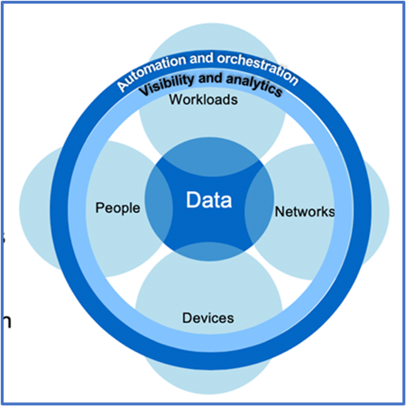

= Entwerfen eines datenorientierten Ansatzes für Zero Trust mit ONTAP
:allow-uri-read: 
:icons: font
:imagesdir: ../media/

[role="lead"]
Ein Zero-Trust-Netzwerk wird durch einen datenorientierten Ansatz definiert, bei dem die Sicherheitskontrollen so nah wie möglich an den Daten sein sollten. Die Funktionen von ONTAP in Kombination mit dem NetApp FPolicy Partner-Ecosystem bieten die erforderlichen Kontrollen für das datenorientierte Zero-Trust-Modell.

ONTAP ist eine sicherheitsreiche Datenmanagement-Software von NetApp und die FPolicy Zero Trust Engine ist eine branchenführende ONTAP-Funktion, die eine granulare, dateibasierte Ereignisbenachrichtigung bietet. NetApp FPolicy Partner können diese Schnittstelle nutzen, um den Datenzugriff innerhalb von ONTAP besser zu nutzen.

== Entwerfen Sie eine datenorientierte MCAP mit Zero Trust

Gehen Sie wie folgt vor, um einen datenorientierten Zero Trust MCAP zu entwickeln:

. Ermitteln Sie den Standort aller Unternehmensdaten.
. Daten klassifizieren:
. Entsorgen Sie Daten, die Sie nicht mehr benötigen.
. Welche Rollen sollten auf die Datenklassifizierungen zugreifen können?
. Wenden Sie das Prinzip „Least Privilege“ an, um Zugriffskontrollen durchzusetzen.
. Multi-Faktor-Authentifizierung für administrativen Zugriff und Datenzugriff
. Verschlüsselung von Daten im Ruhezustand und aktiven Daten
. Überwachen und protokollieren Sie den gesamten Zugriff.
. Alarmieren Sie verdächtige Zugriffe oder Verhaltensweisen.

=== Ermitteln Sie den Standort aller Unternehmensdaten

Mit der FPolicy Funktion von ONTAP und dem NetApp Alliance Partner Ecosystem von FPolicy Partnern können Sie herausfinden, wo sich die Daten Ihres Unternehmens befinden und wer Zugriff auf sie hat. Dies erfolgt mithilfe von Benutzerverhaltensanalysen, die feststellen, ob Datenzugriffsmuster gültig sind. Weitere Details zu User Behavioral Analytics werden unter Überwachen und Protokollieren aller Zugriffe erläutert. Wenn Sie nicht verstehen, wo sich Ihre Daten befinden und wer Zugriff darauf hat, kann die Verhaltensanalyse von Benutzern als Grundlage für die Erstellung von Klassifizierungen und Richtlinien anhand empirischer Beobachtungen dienen.

=== Daten klassifizieren

In der Terminologie des Zero-Trust-Modells beinhaltet die Klassifizierung von Daten die Identifizierung toxischer Daten. Giftige Daten sind sensible Daten, die nicht außerhalb eines Unternehmens offengelegt werden sollen. Die Offenlegung giftiger Daten könnte die Einhaltung gesetzlicher Vorschriften verletzen und den Ruf eines Unternehmens schädigen. Im Hinblick auf die Einhaltung gesetzlicher Vorschriften umfassen toxische Daten Karteninhaberdaten für die , personenbezogene Daten für die https://www.netapp.com/us/media/tr-4401.pdf["Payment Card Industry Data Security Standard (PCI-DSS)"^]EU https://www.netapp.com/us/info/gdpr.aspx["DSGVO (Datenschutz-Grundverordnung)"^]oder Gesundheitsdaten für die https://www.hhs.gov/hipaa/for-professionals/privacy/laws-regulations/index.html["Health Insurance Portability and Accountability Act (HIPAA)"^]. Mit NetApp (ehemals Cloud Data Sense), einem KI-gestützten Toolkit, können https://bluexp.netapp.com/netapp-cloud-data-sense["BlueXP Klassifizierung"^] Sie Ihre Daten automatisch scannen, analysieren und kategorisieren.

=== Entsorgen Sie Daten, die Sie nicht mehr benötigen

Nach der Klassifizierung Ihrer Unternehmensdaten stellen Sie möglicherweise fest, dass einige Ihrer Daten für die Funktion Ihres Unternehmens nicht mehr erforderlich oder relevant sind. Die Aufbewahrung unnötiger Daten ist eine Haftung, und diese Daten sollten gelöscht werden. Einen erweiterten Mechanismus zum kryptografischen Löschen von Daten finden Sie in der Beschreibung zum sicheren Löschen von Daten im Ruhezustand.

=== Verstehen Sie, welche Rollen auf die Datenklassifizierungen zugreifen sollten, und wenden Sie das Prinzip der geringsten Berechtigungen an, um Zugriffskontrollen durchzusetzen

Das Zuordnen von Zugriff auf sensible Daten und die Anwendung des Prinzips der geringsten Rechte bedeutet, dass Mitarbeiter in Ihrem Unternehmen nur auf die Daten zugreifen können, die für die Ausführung ihrer Aufgaben erforderlich sind. Dieser Prozess beinhaltet eine rollenbasierte Zugriffssteuerung (https://docs.netapp.com/us-en/ontap/authentication/index.html["RBAC"^], die für den Datenzugriff und administrativen Zugriff gilt.

Mit ONTAP kann eine Storage Virtual Machine (SVM) verwendet werden, um den Zugriff auf Unternehmensdaten durch Mandanten innerhalb eines ONTAP Clusters zu segmentieren. RBAC kann sowohl auf den Datenzugriff als auch auf den administrativen Zugriff auf die SVM angewendet werden. RBAC kann auch auf der Cluster-Administrationsebene angewendet werden.

Zusätzlich zu RBAC können Sie ONTAP (MAV) verwenden link:../multi-admin-verify/index.html["Verifizierung durch mehrere Administratoren"] , damit ein oder mehrere Administratoren Befehle wie oder genehmigen müssen `volume delete` `volume snapshot delete`. Wenn MAV aktiviert ist, muss MAV durch Ändern oder Deaktivieren der MAV-Administratorfreigabe genehmigt werden.

Eine andere Möglichkeit, Snapshots zu schützen, ist mit ONTAP link:../snaplock/snapshot-lock-concept.html["Snapshot wird gesperrt"]. Beim Snapshot-Sperren handelt es sich um eine SnapLock-Funktion, bei der Snapshots manuell oder automatisch mit einer Aufbewahrungsfrist auf der Snapshot-Richtlinie des Volumes unlöschbar gemacht werden. Snapshot-Sperrung wird auch als manipulationssichere Snapshot Sperrung bezeichnet. Mit dem Zweck der Snapshot-Sperrung können Sie verhindern, dass abnormale oder nicht vertrauenswürdige Administratoren Snapshots auf primären und sekundären ONTAP Systemen löschen. Eine schnelle Recovery von gesperrten Snapshots auf Primärsystemen kann zur Wiederherstellung von durch Ransomware beschädigten Volumes erreicht werden.

=== Multi-Faktor-Authentifizierung für administrativen Zugriff und Datenzugriff

Zusätzlich zur Cluster-administrativen RBAC https://www.netapp.com/us/media/tr-4647.pdf["Multi-Faktor-Authentifizierung (MFA)"^] kann für den ONTAP Web-administrativen Zugriff und den SSH-Zugriff (Secure Shell) über die Befehlszeile implementiert werden. MFA für administrativen Zugriff ist eine Voraussetzung für US-öffentliche Einrichtungen oder solche, die dem PCI-DSS folgen müssen. MFA macht es einem Angreifer unmöglich, ein Konto mit nur einem Benutzernamen und Passwort zu kompromittieren. MFA erfordert zwei oder mehr unabhängige Faktoren für die Authentifizierung. Ein Beispiel für eine zwei-Faktor-Authentifizierung ist etwas, das ein Benutzer besitzt, wie z. B. einen privaten Schlüssel, und etwas, das ein Benutzer kennt, z. B. ein Kennwort. Administrativer Webzugriff auf ONTAP System Manager oder ActiveIQ Unified Manager wird über die SAML (Security Assertion Markup Language) 2.0 aktiviert. Bei SSH-Befehlszeilenzugriff wird eine verkettete zwei-Faktor-Authentifizierung mit einem öffentlichen Schlüssel und einem Kennwort verwendet.

Mit den Identitäts- und Zugriffsverwaltungsfunktionen von ONTAP können Sie den Benutzer- und Maschinenzugriff über APIs steuern:

* Benutzer:
+
** *Authentifizierung und Autorisierung.* Über NAS-Protokollfunktionen für SMB und NFS.
** *Audit.* Syslog für Zugriff und Ereignisse Detaillierte Audit-Protokollierung des CIFS-Protokolls zum Testen von Authentifizierungs- und Autorisierungsrichtlinien Fein abgestimmte FPolicy-Prüfung von detailliertem NAS-Zugriff auf Dateiebene

* Gerät:
+
** *Authentifizierung.* Zertifikatbasierte Authentifizierung für API-Zugriff.
** *Genehmigung.* Standardmäßige oder benutzerdefinierte rollenbasierte Zugriffssteuerung (Role Based Access Control, RBAC)
** *Audit.* Syslog aller durchgeführten Aktionen.

=== Verschlüsselung von Daten im Ruhezustand und aktiven Daten

==== Verschlüsselung von Daten im Ruhezustand

Jeden Tag gelten neue Anforderungen zur Minderung von Risiken für Storage-Systeme und Infrastrukturlücken, wenn ein Unternehmen Laufwerke wiederverwendet, defekte Laufwerke zurückgibt oder Upgrades auf größere Laufwerke durchführt, indem sie diese verkauft oder eintauschen. Von Storage Engineers wird in ihrer Rolle als Administratoren und Betreiber der Datenbestände erwartet, dass sie die Daten während ihres gesamten Lebenszyklus sicher managen und aufbewahren. https://www.netapp.com/us/media/ds-3898.pdf["NetApp Storage Encryption (NSE), NetApp Volume Encryption (NVE), NetApp Aggregate Encryption"^] Damit können Sie alle Ihre Daten im Ruhezustand jederzeit verschlüsseln – unabhängig davon, ob sie toxisch sind oder nicht, und ohne den täglichen Betrieb zu beeinträchtigen. https://www.netapp.com/us/media/ds-3213-en.pdf["NSE"^] Die ONTAP Hardwarelösung link:../encryption-at-rest/index.html["Daten im Ruhezustand"] verwendet validierte Self-Encrypting Drives nach FIPS 140-2 Level 2. https://www.netapp.com/us/media/ds-3899.pdf["NVE und NAE"^] Sind eine ONTAP-Softwarelösung link:../encryption-at-rest/index.html["Daten im Ruhezustand"] , die den nutzt https://csrc.nist.gov/projects/cryptographic-module-validation-program/certificate/4144["Validiertes NetApp Cryptographic Module nach FIPS 140-2 Level 1"^]. Mit NVE und NAE können entweder Festplatten oder Solid State Drives für die Verschlüsselung von Daten im Ruhezustand genutzt werden. Außerdem können NSE-Laufwerke verwendet werden, um eine native, mehrstufige Verschlüsselungslösung für Verschlüsselungsredundanz und zusätzliche Sicherheit bereitzustellen. Ist eine Schicht verletzt, sichert die zweite Schicht weiterhin die Daten. Dank dieser Funktionen ist ONTAP für https://www.netapp.com/us/media/sb-3952.pdf["Quantum-fähige Verschlüsselung"^].

NVE bietet zudem eine Funktion namens „ https://blog.netapp.com/flash-memory-summit-award/["Sicheres Löschen"^] kryptografisch“ zur Beseitigung toxischer Daten bei Verschütten von Daten, wenn sensible Dateien auf ein nicht klassifiziertes Volume geschrieben werden.

Entweder der link:../encryption-at-rest/support-storage-encryption-concept.html["Onboard Key Manager (OKM)"]in ONTAP integrierte Schlüsselmanager oder https://mysupport.netapp.com/matrix/imt.jsp?components=69551;&solution=1156&isHWU&src=IMT["Genehmigt"^] ein Drittanbieter link:../encryption-at-rest/support-storage-encryption-concept.html["Externe Schlüsselmanager"] kann mit NSE und NVE zum sicheren Speichern von Schlüsseln verwendet werden.

image::../media/zero-trust-two-layer-encryption-solution-aff-fas.png[Flussdiagramm der zweischichtigen Verschlüsselungslösung für AFF und FAS]

Wie in der Abbildung oben zu sehen ist, kann die Hardware- und softwarebasierte Verschlüsselung kombiniert werden. Diese Fähigkeit führte zu der, die die https://www.netapp.com/blog/netapp-ontap-CSfC-validation/["Validierung von ONTAP in die kommerziellen Lösungen der NSA für das klassifizierte Programm"^] Speicherung von streng geheimen Daten ermöglicht.

==== Verschlüsselung von aktiven Daten

Die ONTAP Verschlüsselung von aktiven Daten sichert den Zugriff auf Benutzerdaten und Zugriff auf Kontrollebene. Der Benutzerdatenzugriff kann durch SMB 3.0-Verschlüsselung für den Zugriff auf Microsoft CIFS-Freigaben oder durch krb5P für NFS Kerberos 5 verschlüsselt werden. Der Zugriff auf Benutzerdaten kann auch mit für CIFS, NFS und iSCSI verschlüsselt werden link:../networking/ipsec-prepare.html["IPsec"] . Der Zugriff auf die Kontrollebene wird mit Transport Layer Security (TLS) verschlüsselt. ONTAP bietet link:https://docs.netapp.com/us-en/ontap-cli//security-config-modify.html["FIPS"^] einen Compliance-Modus für den Zugriff auf die Kontrollebene, mit dem FIPS-genehmigte Algorithmen aktiviert und nicht FIPS-zertifizierte Algorithmen deaktiviert werden. Die Datenreplikation wird mit verschlüsselt link:../peering/enable-cluster-peering-encryption-existing-task.html["Cluster-Peer-Verschlüsselung"]. Dadurch wird Verschlüsselung für die ONTAP SnapVault und SnapMirror Technologien bereitgestellt.

=== Überwachen und protokollieren Sie den gesamten Zugriff

Nachdem die RBAC-Richtlinien festgelegt sind, müssen Sie aktive Monitoring-, Audit- und Warnfunktionen implementieren. Die FPolicy Zero-Trust-Engine von NetApp ONTAP bietet in Kombination mit dem die https://www.netapp.com/partners/partner-connect["Partner-Ecosystem von NetApp FPolicy"^]erforderlichen Kontrollen für das datenorientierte Zero-Trust-Modell. NetApp ONTAP ist eine sicherheitsrelevante Datenmanagement-Software und link:../nas-audit/two-parts-fpolicy-solution-concept.html["FPolicy"] eine branchenführende ONTAP-Funktion, die eine granulare, dateibasierte Ereignisbenachrichtigung bietet. NetApp FPolicy Partner können diese Schnittstelle nutzen, um den Datenzugriff innerhalb von ONTAP besser zu nutzen. Mit der FPolicy Funktion von ONTAP und dem NetApp Alliance Partner Ecosystem von FPolicy Partnern können Sie feststellen, wo sich die Daten Ihres Unternehmens befinden und wer Zugriff auf sie hat. Dies erfolgt mithilfe von Benutzerverhaltensanalysen, die feststellen, ob Datenzugriffsmuster gültig sind. Mithilfe von Analysen des Benutzerverhaltens lässt sich ein Alarm bei verdächtigem oder irridenem Datenzugriff erstellen, der nicht dem normalen Muster entspricht, und gegebenenfalls Maßnahmen ergreifen, um den Zugriff zu verweigern.

FPolicy-Partner gehen über die Verhaltensanalyse von Benutzern hinaus auf maschinelles Lernen (ML) und künstliche Intelligenz (KI) um, was zu mehr Ereignistreue und weniger, wenn überhaupt, falsche Positives führt. Alle Ereignisse sollten bei einem Syslog-Server oder bei einem SIEM-System (Security Information and Event Management) protokolliert werden, das auch ML und KI einsetzen kann.

image::../media/zero-trust-fpolicy-architecture.png[Architekturdiagramm von FPolicy]

NetApp Storage Workload Security (ehemals bekannt als https://docs.netapp.com/us-en/cloudinsights/cs_intro.html["Cloud Secure"^]) nutzt die FPolicy Schnittstelle und Verhaltensanalysen für Benutzer sowohl in Cloud- als auch in lokalen ONTAP Storage-Systemen, um Ihnen Echtzeitwarnungen über bösartiges Benutzerverhalten zu geben. Dank erweitertem Machine Learning und Anomalieerkennung werden Unternehmensdaten vor Missbrauch durch böswillige oder kompromittierte Benutzer geschützt. Storage Workload Security kann Ransomware-Angriffe oder andere Fehlverhalten identifizieren, Snapshots aufrufen und böswillige Benutzer isolieren. Storage Workload Security verfügt außerdem über eine forensische Funktion zur detaillierten Anzeige von Benutzer- und Entitäten. Storage-Workload-Sicherheit ist Teil von NetApp Cloud Insights.

Zusätzlich zur Sicherheit von Storage-Workloads verfügt ONTAP über eine integrierte Funktion zur Erkennung von Ransomware, die als (ARP) bekannt link:../anti-ransomware/index.html["Autonomer Schutz Durch Ransomware"] ist. ARP ermittelt mithilfe von Machine Learning, ob anormale Dateiaktivitäten auf einen Ransomware-Angriff hindeuten, und ruft einen Snapshot auf und warnt Administratoren. Storage Workload Security ist in ONTAP integrierbar, um ARP-Ereignisse zu empfangen und eine zusätzliche Analysemebene und automatische Reaktionen zu ermöglichen.

Erfahren Sie mehr über die in diesem Verfahren beschriebenen Befehle im link:https://docs.netapp.com/us-en/ontap-cli/["ONTAP-Befehlsreferenz"^].
